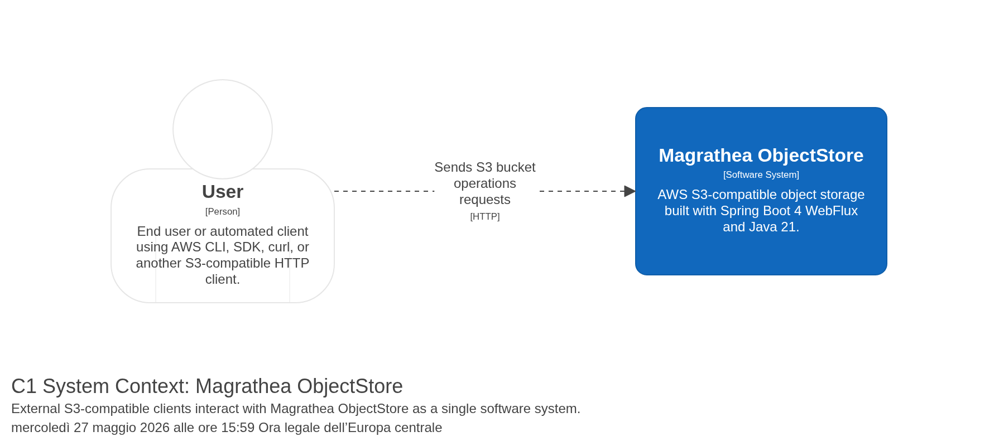

# Magrathea ObjectStore

[](https://openjdk.org/)
[](https://spring.io/)
[](LICENSE)

**Magrathea ObjectStore** is an AWS S3-compatible object storage built with Spring Boot 4 WebFlux and Java 21. The only public HTTP API is the S3 REST API exposed by the pluggable `s3-api` module.

---

## System Context

<div align="center">
  
</div>

*Generated from the Structurizr workspace — see `docs/c4/workspace.dsl` and [`docs/c4/README.md`](docs/c4/README.md).*

---

## Features

- **S3-compatible API only** — no custom internal REST API
- **Implemented operations** — 84 Amazon S3 actions, including bucket/object CRUD, ListObjectsV2, CopyObject, DeleteObjects, bucket location/versioning, object versions, ACLs, tagging, object attributes, bucket configuration (CORS, lifecycle, policy, encryption, logging, website, notification, replication, request payment, ownership controls, public access block, accelerate), multipart uploads, and analytics, inventory, metrics, intelligent-tiering configuration
- **Pluggable S3 API** — auto-configured when `s3-api` is on the classpath; disabled with `s3.api.enabled=false`
- **Spring Boot 4 WebFlux** — functional RouterFunction endpoints
- **Jackson 3 XML** — `tools.jackson.dataformat:jackson-dataformat-xml` with custom WebFlux encoder
- **Pure domain** — no Spring, no JPA, no reactive types in `object-store-domain`
- **In-memory infrastructure** — `InMemoryObjectRepository` and `BucketRepositoryImpl`
- **Testing** — JUnit, Cucumber, AWS CLI compatibility, Clover coverage profile

---

## Architecture

| Module | Responsibility | Notes |
|---|---|---|
| `s3-api` | Pluggable AWS S3 HTTP adapter | Auto-configuration, RouterFunction, XML responses, Cucumber tests |
| `object-store-domain` | S3 domain model | Zero framework dependencies |
| `object-store-application` | Application services and DTOs | Includes `DefaultS3ObjectWrite` carrying `Flux<DataBuffer>` for repository saves |
| `object-store-infrastructure` | Repository implementations | No HTTP API, no S3 router |
| `bootstrap-application` | Spring Boot entry point | Includes `s3-api` to activate S3 endpoints |
| `persistence-context-*` | Reserved placeholders | Empty by design |

### S3 API activation

```properties
# default: enabled when s3-api is on the classpath
s3.api.enabled=true

# disable S3 routes even with s3-api present
s3.api.enabled=false
```

`S3ApiConfig` and `JacksonXmlCodecConfig` are loaded through:

```text
s3-api/src/main/resources/META-INF/spring/org.springframework.boot.autoconfigure.AutoConfiguration.imports
```

---

## Quick Start

```bash
mvn clean test
mvn -pl bootstrap-application -am package -DskipTests
java -jar bootstrap-application/target/bootstrap-application-1.0.0-SNAPSHOT.jar
```

In another shell:

```bash
aws --endpoint-url http://localhost:8080 s3api list-buckets
aws --endpoint-url http://localhost:8080 s3api create-bucket --bucket test-bucket
printf 'Hello\n' > /tmp/hello.txt
aws --endpoint-url http://localhost:8080 s3api put-object --bucket test-bucket --key hello.txt --body /tmp/hello.txt
aws --endpoint-url http://localhost:8080 s3api get-object --bucket test-bucket --key hello.txt /tmp/out.txt
```

---

## Testing

| Level | Type | Command |
|---|---|---|
| 1 | All unit + integration tests | `mvn test` |
| 2 | Domain JUnit only | `mvn test -pl object-store-domain` |
| 3 | S3 API Cucumber only | `mvn test -pl s3-api` |
| 4 | Clover coverage | `mvn -Pcoverage clover:setup test clover:aggregate clover:clover` |
| 5 | AWS CLI compatibility | `bash test-aws-cli.sh` |
| 6 | AWS CLI via Maven profile | `mvn verify -Paws-cli-tests` (auto-starts/stops server) |

Consolidated Markdown report: [`docs/test-report.md`](docs/test-report.md)

### Automated Coverage on Commit

A **pre-commit git hook** generates Clover coverage before every commit:

```bash
# Normal commit — coverage auto-generates
 git commit -m "msg"

# Skip coverage (fast commit)
 git commit --no-verify -m "msg"
```

Or use the helper script:

```bash
bash scripts/commit-with-coverage.sh -m "commit message"
```

The hook runs `mvn -Pcoverage clover:setup test clover:aggregate clover:clover` and stages
`target/site/clover/clover.xml` + `docs/test-report.md`.

AWS CLI tests require:

- AWS CLI installed
- Port 8080 free (the profile starts/stops the server automatically)
- Optional endpoint override: `ENDPOINT_URL=http://host:port bash test-aws-cli.sh`

#### Workflow

```bash
# Manual: start server in one shell, run tests in another
java -jar bootstrap-application/target/bootstrap-application-1.0.0-SNAPSHOT.jar
bash test-aws-cli.sh

# Automatic via Maven (starts server, runs tests, stops server):
mvn verify -Paws-cli-tests
```

The Maven profile (`aws-cli-tests`):
1. **pre-integration-test** — starts the JAR on port 8080
2. **integration-test** — runs `test-aws-cli.sh`
3. **post-integration-test** — stops the server

Use `mvn verify -Paws-cli-tests` for a fully automated AWS CLI compatibility run.

---

## S3 API Roadmap

The implementation plan tracks all Amazon S3 actions from:

<https://docs.aws.amazon.com/AmazonS3/latest/API/API_Operations.md>

Current coverage: **84 / 111 Amazon S3 actions**.

Phases A, B, C, D, and E are complete. Next operations:

1. Advanced/specialized operations (Phase F)

See [`PLAN.md`](PLAN.md) for the full phased inclusion plan.

---

## Documentation

| Artifact | Location |
|---|---|
| Implementation plan | [`PLAN.md`](PLAN.md) |
| ARC42 architecture docs | [`docs/arc42/`](docs/arc42/) |
| ADRs | [`docs/adr/`](docs/adr/) |
| C4 diagrams | [`docs/c4/`](docs/c4/) |
| C4 workflow | [`docs/c4/README.md`](docs/c4/README.md) |

---

## License

[MIT](LICENSE)
