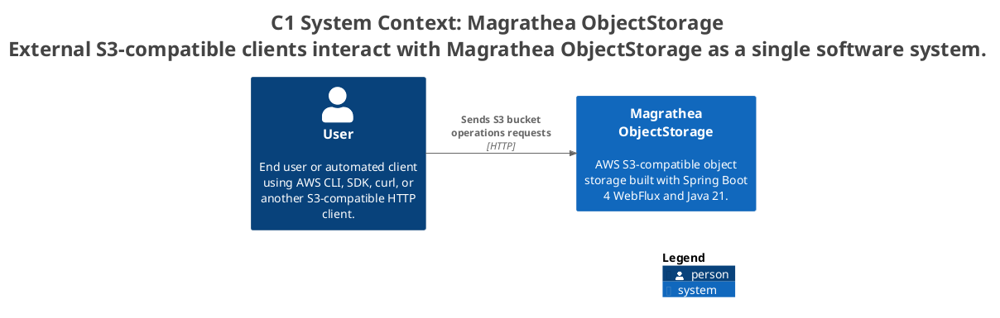

ifndef::imagesdir[:imagesdir: ../images]

[[section-context-and-scope]]
== Context and Scope

=== Business Context

Magrathea ObjectStorage provides an S3-compatible REST API. Users interact with it via HTTP to store and retrieve objects in buckets.

.System Context — Magrathea ObjectStorage

The system context shows:
- **User**: end user interacting via HTTPS — S3-compatible API
- **Magrathea ObjectStorage**: Spring Boot 4 reactive S3-compatible object storage

=== Technical Context

| Communication Partner | Input | Output | Protocol |
|----------------------|-------|--------|----------|
| User (AWS CLI, SDK, HTTP client) | S3 REST API requests (XML/JSON) | S3 REST API responses (XML/JSON) | HTTPS |
| User (binary upload) | Binary data via HTTP PUT | — | HTTP body |
| User (binary download) | — | Binary data via HTTP GET | HTTP body |
