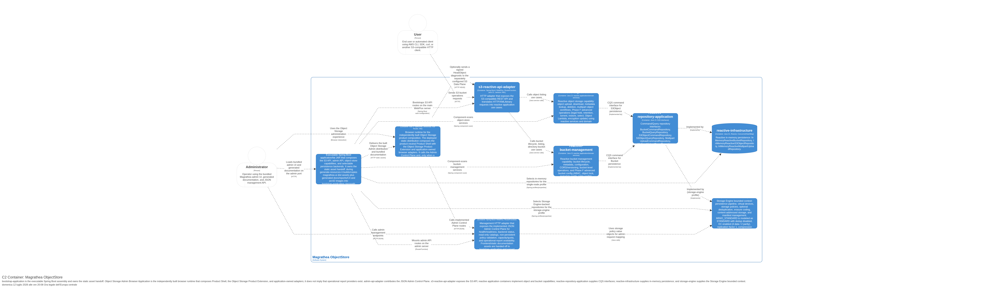
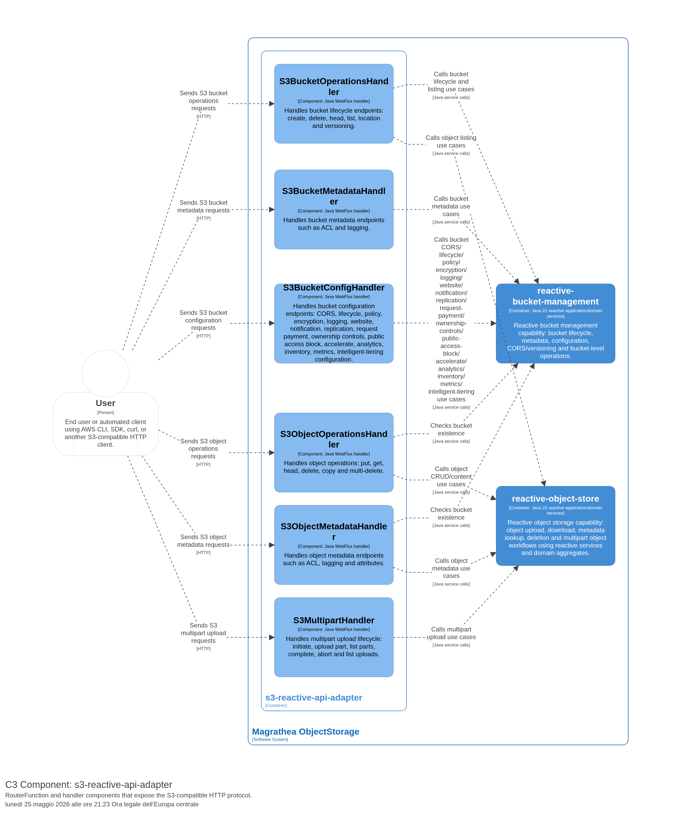
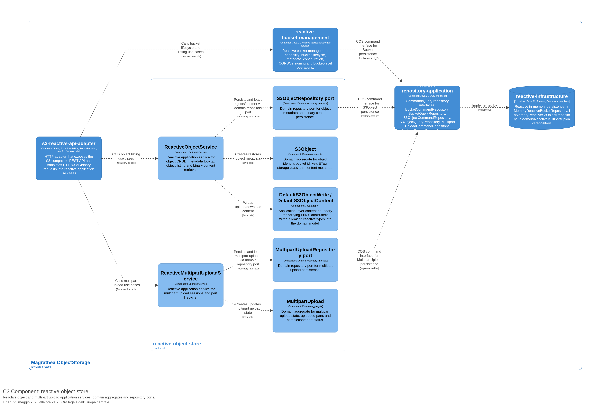
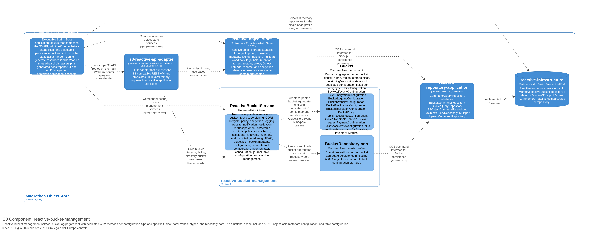
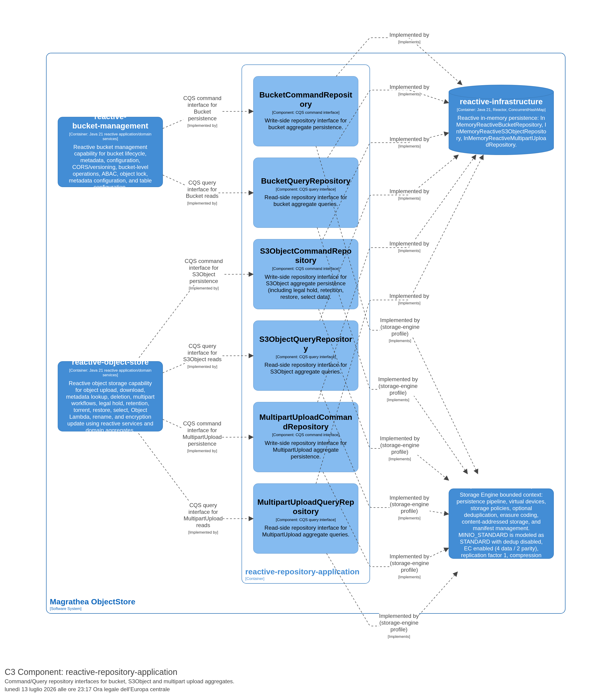
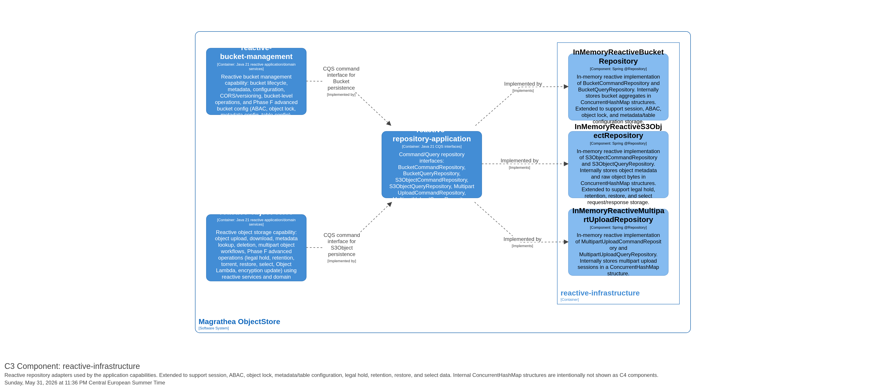

ifndef::imagesdir[:imagesdir: ../images]

[[section-building-block-view]]
== Building Block View

=== Level 1 — Container Diagram

The C2 model distinguishes the public S3 adapter, the internal/admin adapter, the bootstrap runtime assembly, object-store services and repository ports, the in-memory backend, and the Storage Engine backend. Current Storage Engine module names are `storage-engine-domain`, `storage-engine-reactive-application`, and `storage-engine-reactive-infrastructure`.

.C2 Container Diagram — Magrathea ObjectStore


==== bootstrap-application (runtime assembly)

**Blackbox Description:**
Spring Boot executable assembly. It wires the selected backend, includes the S3/admin adapters on the classpath, and serves the generated Vue/admin documentation assets from classpath `static/**` resources, including copied C4 images and generated ARC42 JSON.

- **Provided Interface:** Executable application on the configured HTTP port
- **Required Interface:** S3/admin adapters, object-store services, selected backend beans
- **Technology:** Spring Boot 4, Java 21, classpath static resources

==== s3-reactive-api-adapter (HTTP adapter)

**Blackbox Description:**
Exposes the S3-compatible REST API via RouterFunction WebFlux. Translates HTTP/XML/binary requests into calls to reactive application services. Serializes XML responses with Jackson 3.

Handlers follow a strict **minimal pattern**:
- **Extract** HTTP headers, path variables, and query parameters into primitives/DTOs via `S3RequestExtractor`
- **Delegate** to reactive application services (no validation, no bucket checks, no ETag computation)
- **Response** via `S3ResponseBuilder` or direct XML serialization

All validation, bucket existence checks, ETag computation, CORS validation, and website routing are **postponed to the repository layer**.

- **Provided Interface:** S3 REST API route surface (111 in-scope routes; route inventory only, not semantic completion)
- **Required Interface:** ReactiveBucketService, ReactiveObjectService, ReactiveMultipartUploadService
- **Technology:** Spring Boot 4 WebFlux, Java 21, RouterFunction, Jackson 3 XML

==== reactive-object-store (Reactive object storage capability)

**Blackbox Description:**
Implements reactive object CRUD, multipart upload, content retrieval, and Phase F advanced object use cases using Mono/Flux. Contains reactive application services (ReactiveObjectService, ReactiveMultipartUploadService), domain aggregates (S3Object, MultipartUpload), and repository ports.

- **Provided Interface:** ReactiveObjectService, ReactiveMultipartUploadService
- **Required Interface:** BucketRepository (read), S3ObjectCommandRepository, S3ObjectQueryRepository, MultipartUploadCommandRepository, MultipartUploadQueryRepository
- **Technology:** Java 21, Spring @Service, Reactor Mono/Flux, domain aggregates

==== reactive-bucket-management (Reactive bucket management capability)

**Blackbox Description:**
Implements reactive bucket lifecycle, metadata (ACL, tagging), configuration (CORS, lifecycle, policy, encryption, logging, website, notification, replication, request payment, ownership controls, public access block, accelerate), advanced configuration (analytics, inventory, metrics, intelligent-tiering), and Phase F bucket metadata/ABAC/object-lock configuration use cases using Mono/Flux. Contains ReactiveBucketService, the Bucket aggregate root (with dedicated configuration value objects and domain events), and repository ports. Configuration lives inside the Bucket aggregate — there is no separate configuration service.

- **Provided Interface:** ReactiveBucketService
- **Required Interface:** BucketCommandRepository, BucketQueryRepository
- **Technology:** Java 21, Spring @Service, Reactor Mono/Flux, domain aggregates

==== reactive-repository-application (CQS repository interfaces)

**Blackbox Description:**
Implements the Command-Query Separation (CQS) pattern at the application layer. Provides separate command and query repository interfaces for each aggregate (Bucket, S3Object, MultipartUpload). Bridges domain repository ports to reactive persistence adapters.

- **Provided Interface:** BucketCommandRepository, BucketQueryRepository, S3ObjectCommandRepository, S3ObjectQueryRepository, MultipartUploadCommandRepository, MultipartUploadQueryRepository
- **Required Interface:** Reactive persistence implementations
- **Technology:** Java 21, Mono/Flux, CQS pattern

==== reactive-infrastructure (In-process reactive database)

**Blackbox Description:**
Implements reactive in-memory repositories with ConcurrentHashMap using Mono/Flux. Not an external database — resets when the process stops.

- **Provided Interface:** InMemoryReactiveBucketRepository, InMemoryReactiveS3ObjectRepository, InMemoryReactiveMultipartUploadRepository
- **Required Interface:** CQS repository interfaces
- **Technology:** Java 21, ConcurrentHashMap, Reactor
- **Tag:** Database

==== admin-api-adapter (internal/admin HTTP adapter)

**Blackbox Description:**
Exposes `/admin/**` JSON endpoints for health, storage policy, storage device, and configuration management. These endpoints are internal/administrative and are not part of the S3 object API coverage.

- **Provided Interface:** Admin JSON API
- **Required Interface:** Storage policy/device catalog ports and selected backend status
- **Technology:** Spring Boot 4 WebFlux, Java 21, RouterFunction

==== storage-engine-reactive-application and storage-engine-reactive-infrastructure

**Blackbox Description:**
`storage-engine-reactive-application` owns reactive orchestration ports such as the chunker, storage policy catalog, and `ReactiveStorageOrchestrator`. `storage-engine-reactive-infrastructure` provides YAML-backed catalogs and filesystem-oriented persistence adapters. Phase 5 verifies deterministic `MINIO_STANDARD` planning; runtime read/write and physical EC shard placement remain pending verification gates.

`MINIO_STANDARD` maps to S3 storage class `STANDARD`, disables deduplication, enables erasure-coding planning as `4 data / 2 parity`, uses replication factor `1`, disables compression, and leaves encryption disabled by default.

- **Provided Interface:** Storage Engine orchestration and catalog ports/adapters
- **Required Interface:** Storage Engine domain model and filesystem/configuration resources
- **Technology:** Java 21, Reactor, YAML configuration, filesystem adapters

=== Level 2 — Component Diagram (s3-reactive-api-adapter)

.C3 Component — s3-reactive-api-adapter


| Component | Responsibility | Handler Pattern |
|---|---|---|
| `S3PathRouter` | Entry point RouterFunction: defines S3 routes and dispatches requests to handlers | — |
| `S3BucketOperationsHandler` | Bucket lifecycle: create, delete, head, list, location, versioning, directory-bucket listing | ✅ Minimal (extract → delegate → response) |
| `S3BucketMetadataHandler` | Bucket metadata: ACL, tagging | ✅ Minimal (extract → delegate → response) |
| `S3BucketConfigHandler` | Bucket configuration: CORS, lifecycle, policy, encryption, logging, website, notification, replication, request payment, ownership controls, public access block, accelerate, analytics, inventory, metrics, intelligent-tiering, ABAC, object lock, bucket metadata/table configuration | ⏳ Excluded (complex registry + ConcurrentHashMap — postponed) |
| `S3ObjectOperationsHandler` | Object CRUD, copy, multi-delete, rename, torrent, restore, select, Object Lambda response | ✅ Minimal (extract → delegate → response) |
| `S3ObjectMetadataHandler` | Object metadata: ACL, tagging, attributes, legal hold, retention, encryption metadata | ✅ Minimal (extract → delegate → response) |
| `S3MultipartHandler` | Multipart upload lifecycle: initiate, upload, complete, abort, list | ✅ Minimal (extract → delegate → response) |
| `S3SessionHandler` | CreateSession support for Phase F session management | ✅ Minimal (extract → delegate → response) |
| `S3WebSupport` | Shared request predicates, parsing, lookup, error helpers | — |

=== Level 2 — Component Diagram (reactive-object-store)

.C3 Component — reactive-object-store


| Component | Responsibility |
|---|---|
| `ReactiveObjectService` | Reactive application service: object CRUD, metadata, listing, content retrieval via Mono/Flux |
| `ReactiveMultipartUploadService` | Reactive application service: multipart upload session and part lifecycle via Mono/Flux |
| `S3Object` | Domain aggregate: object identity, key, ETag, storage class, metadata |
| `MultipartUpload` | Domain aggregate: multipart state, uploaded parts, completion/abort |
| `S3ObjectRepository port` | Repository port: object metadata and binary content persistence |
| `MultipartUploadRepository port` | Repository port: multipart upload persistence |
| `BucketRepository read port` | Read-side repository port: bucket existence validation |
| `DefaultS3ObjectWrite / DefaultS3ObjectContent` | Application-layer content boundary: Flux<DataBuffer> without leaking into the domain |

=== Level 2 — Component Diagram (reactive-bucket-management)

.C3 Component — reactive-bucket-management


| Component | Responsibility |
|---|---|
| `ReactiveBucketService` | Reactive application service: bucket lifecycle, versioning, CORS, lifecycle, policy, encryption, logging, website, notification, replication, request payment, ownership controls, public access block, accelerate, analytics, inventory, metrics, intelligent-tiering, ABAC, object lock, and metadata configuration via Mono/Flux |
| `Bucket` | Domain aggregate root: bucket identity, name, region, storage class, versioning, encryption, and dedicated configuration fields per config type (CORS, Lifecycle, Encryption, Logging, Website, Notification, Replication, Policy, PublicAccessBlock, OwnershipControls, RequestPayment, Accelerate, plus multi-instance maps for Analytics, Inventory, Metrics, Intelligent-Tiering). Emits specific ObjectStoreEvent subtypes per config change (e.g., `BucketLifecycleConfigurationChanged`, `BucketNotificationConfigurationChanged`). Each config feature has a dedicated `with*()` / `without*()` method — no generic `withConfiguration()` / flat `Configuration` record. |
| `BucketRepository port` | Repository port: bucket metadata and configuration persistence |

=== Level 2 — Component Diagram (reactive-repository-application)

.C3 Component — reactive-repository-application


| Component | Responsibility |
|---|---|
| `BucketCommandRepository` | Command repository: bucket writes (save, delete) via Mono<Void> |
| `BucketQueryRepository` | Query repository: bucket reads (find by id, find by name) via Mono<Bucket> |
| `S3ObjectCommandRepository` | Command repository: object writes (save, delete) via Mono<Void> |
| `S3ObjectQueryRepository` | Query repository: object reads (find by id, find by bucket, list) via Mono<Flux<S3Object>> |
| `MultipartUploadCommandRepository` | Command repository: multipart upload writes (save, delete, update parts) via Mono<Void> |
| `MultipartUploadQueryRepository` | Query repository: multipart upload reads (find by upload id, list by bucket) via Mono<Flux<MultipartUpload>> |

=== Level 2 — Component Diagram (reactive-infrastructure)

.C3 Component — reactive-infrastructure


| Component | Responsibility |
|---|---|
| `InMemoryReactiveBucketRepository` | In-memory reactive BucketRepository: ConcurrentHashMap for bucket aggregates and configuration via Mono/Flux |
| `InMemoryReactiveS3ObjectRepository` | In-memory reactive S3ObjectRepository: ConcurrentHashMap for metadata and raw bytes via Mono/Flux |
| `InMemoryReactiveMultipartUploadRepository` | In-memory reactive MultipartUploadRepository: ConcurrentHashMap for upload sessions via Mono/Flux |

=== Level 3 — Code View (Aggregate Root Patterns)

The domain aggregates follow a strict state transition pattern:

==== Bucket Aggregate

`Bucket` is the root aggregate for bucket management. It enforces all state transitions through dedicated `with*()` methods:

```java
public interface Bucket {
    // Lifecycle
    Bucket withVersioningEnabled();
    Bucket withVersioningSuspended();
    Bucket withDeleted();

    // Configuration (one per config type)
    Bucket withCorsConfiguration(CorsConfiguration cors);
    Bucket withoutCorsConfiguration();
    Bucket withLifecycleConfiguration(BucketLifecycleConfiguration lifecycle);
    Bucket withoutLifecycleConfiguration();
    Bucket withEncryptionConfiguration(BucketEncryptionConfiguration encryption);
    Bucket withoutEncryptionConfiguration();
    Bucket withLoggingConfiguration(BucketLoggingConfiguration logging);
    Bucket withoutLoggingConfiguration();
    Bucket withWebsiteConfiguration(BucketWebsiteConfiguration website);
    Bucket withoutWebsiteConfiguration();
    Bucket withNotificationConfiguration(BucketNotificationConfiguration notification);
    Bucket withoutNotificationConfiguration();
    Bucket withReplicationConfiguration(BucketReplicationConfiguration replication);
    Bucket withoutReplicationConfiguration();
    Bucket withPolicy(BucketPolicy policy);
    Bucket withoutPolicy();
    Bucket withPublicAccessBlockConfiguration(PublicAccessBlockConfiguration publicAccessBlock);
    Bucket withoutPublicAccessBlockConfiguration();
    Bucket withOwnershipControls(BucketOwnershipControls ownershipControls);
    Bucket withoutOwnershipControls();
    Bucket withRequestPaymentConfiguration(BucketRequestPaymentConfiguration requestPayment);
    Bucket withoutRequestPaymentConfiguration();
    Bucket withAccelerateConfiguration(BucketAccelerateConfiguration accelerate);
    Bucket withoutAccelerateConfiguration();

    // Multi-instance config (analytics, inventory, metrics, intelligent-tiering)
    Bucket withAnalyticsConfiguration(String id, BucketAnalyticsConfiguration analytics);
    Bucket withoutAnalyticsConfiguration(String id);
    Bucket withInventoryConfiguration(String id, BucketInventoryConfiguration inventory);
    Bucket withoutInventoryConfiguration(String id);
    Bucket withMetricsConfiguration(String id, BucketMetricsConfiguration metrics);
    Bucket withoutMetricsConfiguration(String id);
    Bucket withIntelligentTieringConfiguration(String id, BucketIntelligentTieringConfiguration tiering);
    Bucket withoutIntelligentTieringConfiguration(String id);

    // Domain event access
    List<ObjectStoreEvent> domainEvents();
    Bucket clearEvents();
}
```

==== S3Object Aggregate

`S3Object` enforces state transitions for object lifecycle, metadata, ACL, tagging, legal hold, retention, and encryption:

```java
public interface S3Object {
    S3Object withDeleted();
    S3Object withEtag(String etag);
    S3Object withStorageClass(StorageClass storageClass);
    S3Object withAcl(AccessControlPolicy acl);
    S3Object withTagging(Map<String, String> tagging);
    S3Object withLegalHold(LegalHold legalHold);
    S3Object withoutLegalHold();
    S3Object withRetention(RetentionPeriod retention);
    S3Object withoutRetention();
    S3Object withEncryption(EncryptionConfiguration encryption);
    S3Object withoutEncryption();
    List<ObjectStoreEvent> domainEvents();
    S3Object clearEvents();
}
```

==== MultipartUpload Aggregate

`MultipartUpload` enforces multipart upload lifecycle transitions:

```java
public interface MultipartUpload {
    MultipartUpload withPartUploaded(UploadPart part);
    MultipartUpload withCompleted();
    MultipartUpload withAborted();
    List<ObjectStoreEvent> domainEvents();
    MultipartUpload clearEvents();
}
```

=== Registry-Based Handler Dispatch

The `S3BucketConfigHandler` uses a registry/strategy pattern to dispatch configuration operations:

```java
public class S3BucketConfigHandler {
    private final ConfigHandlerRegistry registry;

    Mono<ServerResponse> handleGet(ServerRequest request, ConfigType type) {
        ConfigHandlerStrategy strategy = registry.lookup(type);
        // strategy performs GET using typed methods
        return strategy.handleGet(request);
    }

    Mono<ServerResponse> handlePut(ServerRequest request, ConfigType type) {
        ConfigHandlerStrategy strategy = registry.lookup(type);
        // strategy performs PUT using typed methods
        return strategy.handlePut(request);
    }

    Mono<ServerResponse> handleDelete(ServerRequest request, ConfigType type) {
        ConfigHandlerStrategy strategy = registry.lookup(type);
        // strategy performs DELETE using typed methods
        return strategy.handleDelete(request);
    }
}
```

=== Important Interfaces

| Interface | Description | Connected Containers |
|---|---|---|
| S3 REST API | Public object API — AWS S3-compatible route surface only | User ↔ s3-reactive-api-adapter |
| Admin JSON API | Internal/administrative `/admin/**` API for policy/device/configuration management; not S3 coverage | Operator/Admin UI ↔ admin-api-adapter |
| Reactive service calls | ReactiveBucketService, ReactiveObjectService, ReactiveMultipartUploadService via Mono/Flux | s3-reactive-api-adapter ↔ reactive-object-store / reactive-bucket-management |
| CQS repository interfaces | Mono/Flux-based command and query ports | reactive-object-store / reactive-bucket-management ↔ reactive-repository-application |
| Repository implementations | Reactive in-memory adapters or Storage Engine ACL adapter, selected explicitly | reactive-repository-application ↔ reactive-infrastructure / object-store-reactive-repository-storage-engine-infrastructure |
| Bucket lookup | Bucket existence validation | reactive-object-store → reactive-bucket-management |
