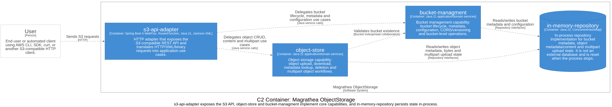

ifndef::imagesdir[:imagesdir: ../images]

[[section-building-block-view]]
== Building Block View

=== Level 1 — Container Diagram

The system consists of two runtime containers:

.S3 Server + File Store — C2 Container Diagram

==== S3 Server (Spring Boot 4 WebFlux JAR)

**Blackbox Description:**
Il container `s3-server` è un processo Spring Boot 4 WebFlux che espone gli endpoint REST S3-compatible. Riceve richieste HTTP, le instrada via RouterFunction, orchestra le operazioni tramite servizi applicativi, e serializza le risposte in XML S3 con Jackson 3.

- **Provided Interface:** S3 REST API (30 endpoints su 111)
- **Required Interface:** `S3ObjectRepository` / `BucketRepository` (CompletableFuture) verso File Store
- **Technology:** Spring Boot 4 WebFlux, Java 21, Jackson 3 XML, RouterFunction

==== File Store (Java 21 in-memory + file persistence)

**Blackbox Description:**
Il container `file-store` è un archivio in-memory (ConcurrentHashMap) che persiste metadata e contenuto binario degli oggetti S3. Implementa le interfacce repository del dominio puro. Singolo nodo, senza clustering.

- **Provided Interface:** `BucketRepositoryImpl`, `InMemoryObjectRepository` (CompletableFuture)
- **Required Interface:** Nessuna (è un leaf container)
- **Technology:** Java 21, ConcurrentHashMap, byte[] interni

=== Level 2 — Component Diagram (S3 Server)

Il container `s3-server` si scompone in componenti logici organizzati per responsabilità:

[cols="1,3,2" options="header"]
|===
| Component | Responsibility | Note

| `S3ProxyRouter`
| Composizione delle route RouterFunction
| Unico punto di ingresso HTTP

| `S3BucketOperationsHandler`
| Gestione lifecycle bucket, bucket listing, bucket location, versioning
| Create/Delete/Head/List bucket

| `S3BucketMetadataHandler`
| Gestione metadata bucket (ACL, tagging, CORS)
| Get/Put/Delete ACL, tagging, CORS

| `S3ObjectOperationsHandler`
| Gestione CRUD oggetti, copy, multi-delete
| Put/Get/Head/Delete object, copy, delete-objects

| `S3ObjectMetadataHandler`
| Gestione metadata oggetti (ACL, tagging, attributes)
| Get/Put/Delete ACL, tagging; get attributes

| `S3WebSupport`
| Predicati richiesta, lookup oggetti, error helpers S3-compatible
| Accept header matching, copy-source decode, S3Error XML

| `S3XmlResponses`
| Record XML Jackson 3 per risposte S3
| ListAllMyBucketsResult, ListBucketResult, Error, ACL, Tagging, ecc.

| `JacksonXmlCodecConfig`
| Registrazione JacksonXmlEncoder in WebFlux
| Codec per bodyValue() XML

| `S3ApiConfig`
| Auto-configuration Spring Boot condizionale
| `@ConditionalOnClass` + `s3.api.enabled`

| `BucketService`
| Orchestrazione operazioni bucket
| Lifecycle, ACL, tagging, CORS, versioning

| `ObjectService`
| Orchestrazione operazioni oggetti
| CRUD, copy, multi-delete, ACL, tagging, attributes

| `DefaultS3ObjectWrite` / `DefaultS3ObjectContent`
| Bridge contenuto binario: dominio puro ↔ Flux<DataBuffer>
| Trasporta Flux<DataBuffer> al confine applicativo

| DTO records
| Comandi e risposte per i servizi applicativi
| CreateBucketCommand, PutObjectCommand, ecc.
|===

=== Level 2 — Component Diagram (File Store)

Il container `file-store` si scompone in:

[cols="1,3" options="header"]
|===
| Component | Responsibility

| `BucketRepositoryImpl`
| Implementazione in-memory di BucketRepository (ConcurrentHashMap)

| `InMemoryObjectRepository`
| Implementazione in-memory di S3ObjectRepository: metadata + content bytes

| `InfrastructureConfig`
| Configurazione bean infrastruttura
|===

=== Important Interfaces

[cols="1,3,3" options="header"]
|===
| Interface | Description | Connected Components

| S3 REST API
| Public HTTP API — solo endpoint AWS S3-compatible (XML/JSON + binary)
| User ↔ S3ProxyRouter

| BucketService / ObjectService
| Service interface tra HTTP adapter e applicazione
| S3*Handler ↔ Service

| Domain Repository interfaces
| Interfacce CompletableFuture: BucketRepository, S3ObjectRepository
| Service ↔ Domain Model ↔ Infrastructure

| S3ObjectWrite / S3ObjectContent
| Contratti di contenuto binario senza tipi reattivi nel dominio
| Service ↔ Domain ↔ InMemoryObjectRepository

| Spring Boot auto-configuration
| `META-INF/spring/*.imports` per plugin S3 API
| bootstrap-application ↔ s3-api
|===
