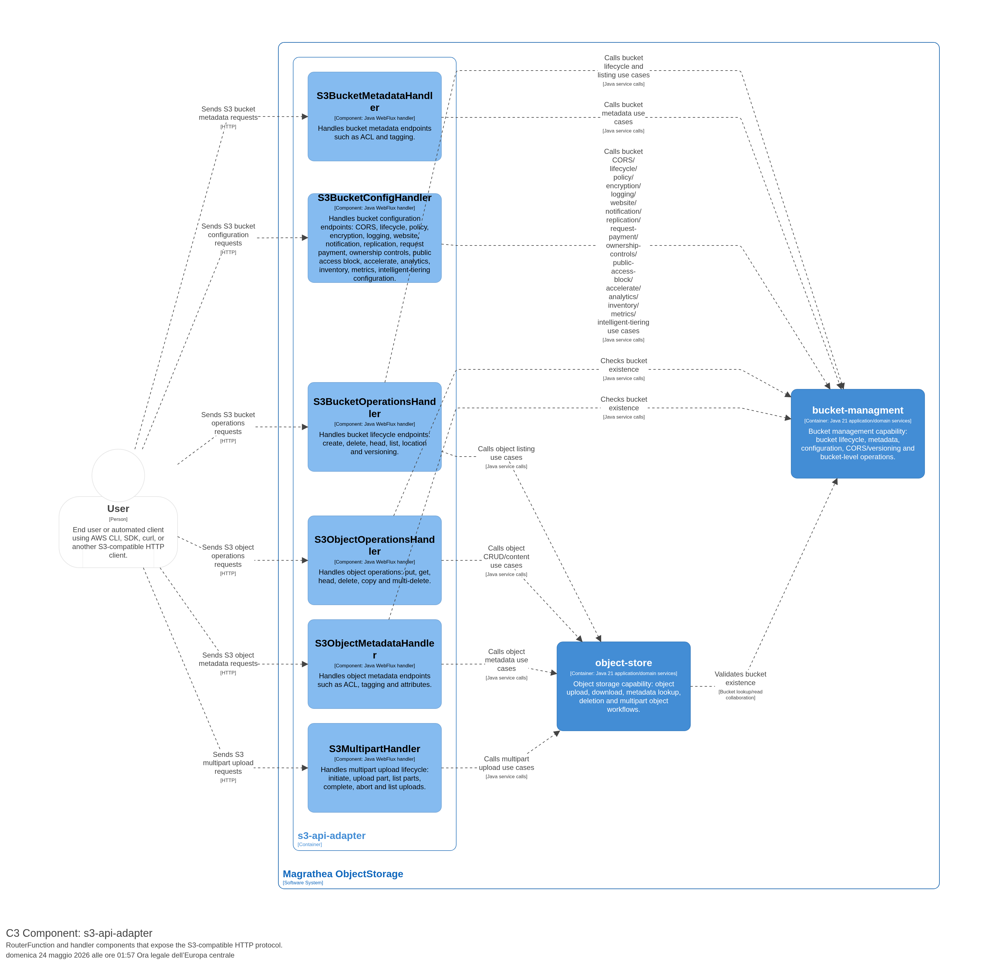
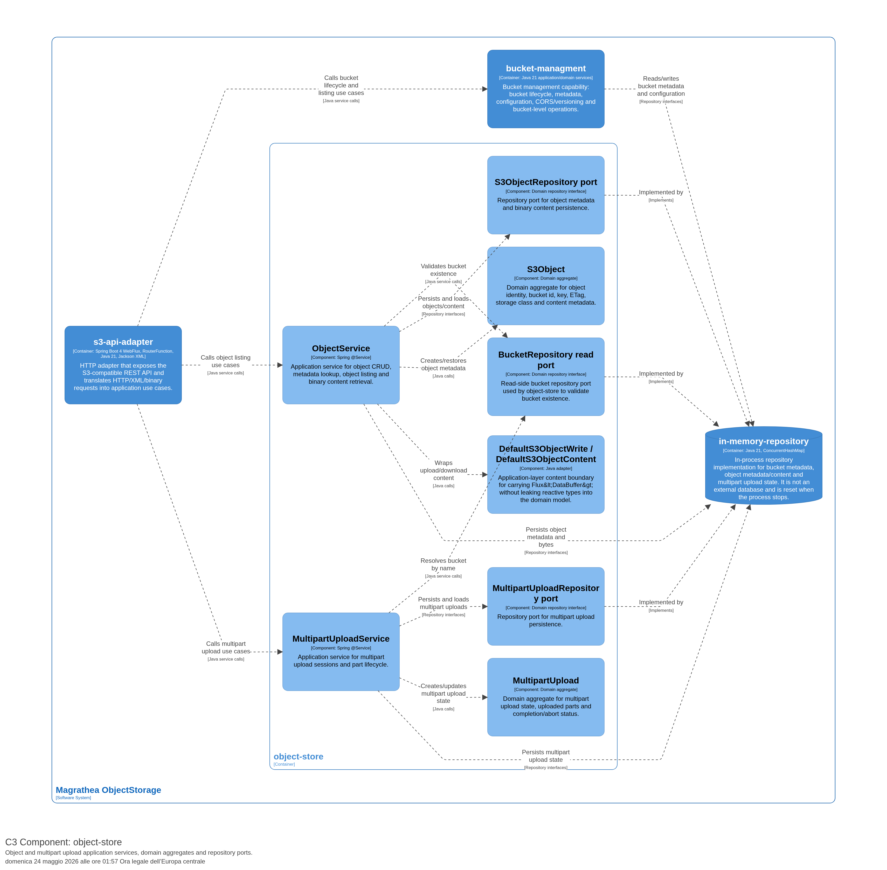
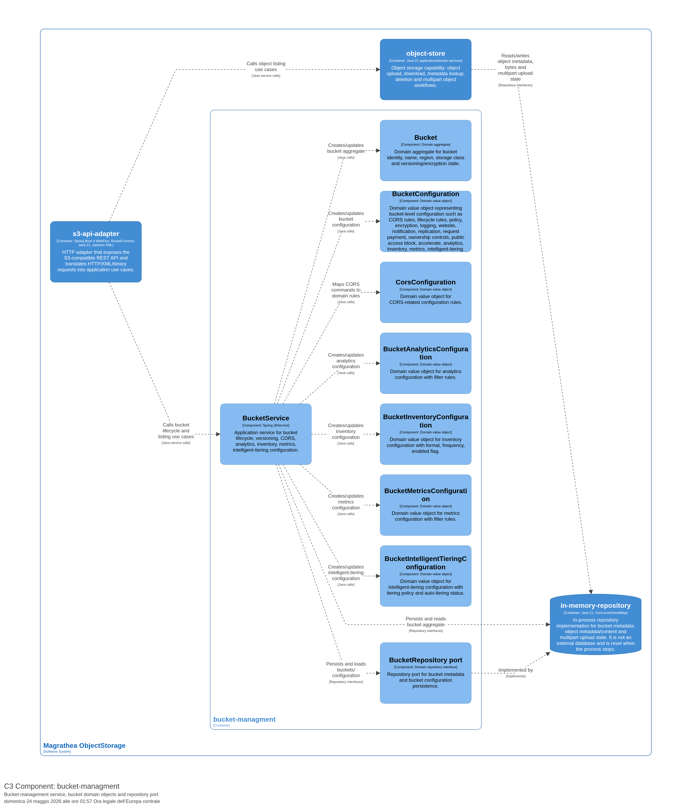
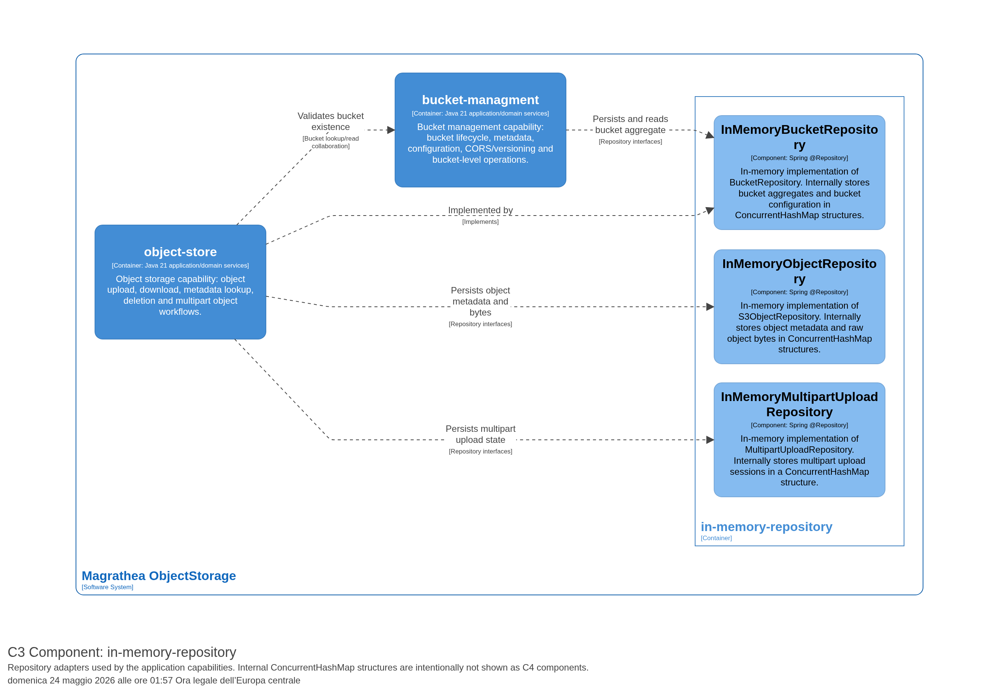

ifndef::imagesdir[:imagesdir: ../images]

[[section-building-block-view]]
== Building Block View

=== Level 1 — Container Diagram

Il sistema è composto da quattro container runtime:

.C2 Container Diagram — Magrathea ObjectStorage
image::../../c4/images/Container.png[Container Diagram, width=600]

==== s3-api-adapter (HTTP adapter)

**Blackbox Description:**
Espone l'API REST S3-compatible via RouterFunction WebFlux. Traduce richieste HTTP/XML/binary in chiamate ai servizi applicativi. Serializza le risposte XML con Jackson 3.

- **Provided Interface:** S3 REST API (84 endpoints su 111)
- **Required Interface:** ObjectService, MultipartUploadService, BucketService
- **Technology:** Spring Boot 4 WebFlux, Java 21, RouterFunction, Jackson 3 XML

==== object-store (Object storage capability)

**Blackbox Description:**
Implementa le use case di object CRUD, multipart upload, e content retrieval. Contiene i service application, gli aggregate di dominio (S3Object, MultipartUpload), e i port di repository.

- **Provided Interface:** ObjectService, MultipartUploadService
- **Required Interface:** BucketRepository (read), S3ObjectRepository, MultipartUploadRepository
- **Technology:** Java 21, Spring @Service, domain aggregates

==== bucket-managment (Bucket management capability)

**Blackbox Description:**
Implementa le use case di bucket lifecycle, metadata (ACL, tagging), configurazione (CORS, lifecycle, policy, encryption, logging, website, notification, replication, request payment, ownership controls, public access block, accelerate), e advanced configuration (analytics, inventory, metrics, intelligent-tiering). Contiene BucketService, gli aggregate di dominio (Bucket, BucketConfiguration, CorsConfiguration, BucketAnalyticsConfiguration, BucketInventoryConfiguration, BucketMetricsConfiguration, BucketIntelligentTieringConfiguration), e i port di repository.

- **Provided Interface:** BucketService
- **Required Interface:** BucketRepository
- **Technology:** Java 21, Spring @Service, domain aggregates

==== in-memory-repository (In-process database)

**Blackbox Description:**
Implementa i repository di dominio in-memory con ConcurrentHashMap. Non è un database esterno — viene resettato quando il processo termina.

- **Provided Interface:** BucketRepositoryImpl, InMemoryObjectRepository, InMemoryMultipartUploadRepository
- **Required Interface:** Domain repository interfaces
- **Technology:** Java 21, ConcurrentHashMap
- **Tag:** Database

=== Level 2 — Component Diagram (s3-api-adapter)

.C3 Component — s3-api-adapter

| Component | Responsibility |
|---|---|
| `S3ProxyRouter` | Entry point RouterFunction: definisce le route S3 e dispatches richieste agli handler |
| `S3BucketOperationsHandler` | Bucket lifecycle: create, delete, head, list, location, versioning |
| `S3BucketMetadataHandler` | Bucket metadata: ACL, tagging |
| `S3BucketConfigHandler` | Bucket configuration: CORS, lifecycle, policy, encryption, logging, website, notification, replication, request payment, ownership controls, public access block, accelerate, analytics, inventory, metrics, intelligent-tiering |
| `S3ObjectOperationsHandler` | Object CRUD, copy, multi-delete |
| `S3ObjectMetadataHandler` | Object metadata: ACL, tagging, attributes |
| `S3MultipartHandler` | Multipart upload lifecycle: initiate, upload, complete, abort, list |
| `S3WebSupport` | Shared request predicates, parsing, lookup, error helpers |

=== Level 2 — Component Diagram (object-store)

.C3 Component — object-store

| Component | Responsibility |
|---|---|
| `ObjectService` | Application service: object CRUD, metadata, listing, content retrieval |
| `MultipartUploadService` | Application service: multipart upload session e part lifecycle |
| `S3Object` | Domain aggregate: object identity, key, ETag, storage class, metadata |
| `MultipartUpload` | Domain aggregate: multipart state, uploaded parts, completion/abort |
| `S3ObjectRepository port` | Repository port: object metadata e binary content persistence |
| `MultipartUploadRepository port` | Repository port: multipart upload persistence |
| `BucketRepository read port` | Read-side repository port: validazione esistenza bucket |
| `DefaultS3ObjectWrite / DefaultS3ObjectContent` | Application-layer content boundary: Flux<DataBuffer> senza leak nel dominio |

=== Level 2 — Component Diagram (bucket-managment)

.C3 Component — bucket-managment

| Component | Responsibility |
|---|---|
| `BucketService` | Application service: bucket lifecycle, versioning, CORS, lifecycle, policy, encryption, logging, website, notification, replication, request payment, ownership controls, public access block, accelerate, analytics, inventory, metrics, intelligent-tiering configuration |
| `Bucket` | Domain aggregate: bucket identity, name, region, storage class, versioning |
| `BucketConfiguration` | Domain value object: bucket-level configuration (CORS rules) |
| `CorsConfiguration` | Domain value object: CORS-related configuration |
| `BucketAnalyticsConfiguration` | Domain value object: analytics configuration with filter rules |
| `BucketInventoryConfiguration` | Domain value object: inventory configuration with format, frequency, enabled flag |
| `BucketMetricsConfiguration` | Domain value object: metrics configuration with filter rules |
| `BucketIntelligentTieringConfiguration` | Domain value object: intelligent-tiering configuration with tiering policy and auto-tiering status |
| `BucketRepository port` | Repository port: bucket metadata e configuration persistence |

=== Level 2 — Component Diagram (in-memory-repository)

.C3 Component — in-memory-repository

| Component | Responsibility |
|---|---|
| `BucketRepositoryImpl` | In-memory BucketRepository: ConcurrentHashMap per bucket aggregates e configuration |
| `InMemoryObjectRepository` | In-memory S3ObjectRepository: ConcurrentHashMap per metadata e raw bytes |
| `InMemoryMultipartUploadRepository` | In-memory MultipartUploadRepository: ConcurrentHashMap per upload sessions |

=== Important Interfaces

| Interface | Description | Connected Containers |
|---|---|---|
| S3 REST API | Public HTTP API — solo endpoint AWS S3-compatible | User ↔ s3-api-adapter |
| Service calls | ObjectService, MultipartUploadService, BucketService | s3-api-adapter ↔ object-store/bucket-managment |
| Repository interfaces | CompletableFuture-based domain ports | object-store/bucket-managment ↔ in-memory-repository |
| Bucket lookup | Validazione esistenza bucket | object-store → bucket-managment |
