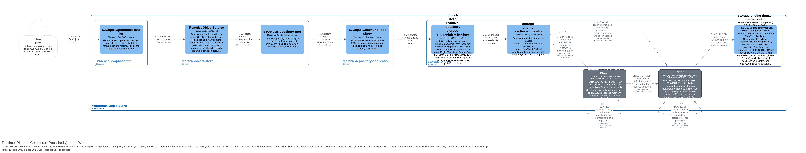
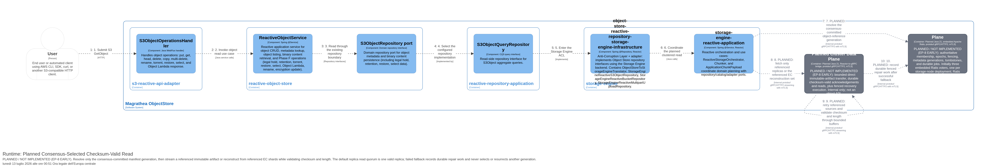

ifndef::imagesdir[:imagesdir: ../images]

[[section-runtime-view]]
== Runtime View

The runtime view describes the key interaction scenarios of the Magrathea ObjectStore system. These scenarios illustrate how the building blocks collaborate to implement S3-compatible operations.

=== Scenario 1 — CreateBucket

.Runtime Diagram — CreateBucket
image::../../c4/images/CreateBucketRuntime.png[CreateBucket Runtime, width=600]

**Flow:**
1. User → s3-reactive-api-adapter: `PUT /{bucket}`
2. s3-reactive-api-adapter → reactive-bucket-management: CreateBucket use case
3. reactive-bucket-management → reactive-repository-application: Save Bucket aggregate via command repository
4. reactive-repository-application → reactive-infrastructure (default) or object-store-reactive-repository-storage-engine-infrastructure (storage-engine profile): Persist Bucket aggregate

**Durability note:** in storage-engine mode, the full `BucketConfig` document is committed to `metadata/buckets/` via `BucketStore` with a crash-safe temp-file + atomic-rename write, so the bucket survives a process restart. In the default in-memory profile, the bucket does not survive a restart.

=== Scenario 2 — PutObject

.Runtime Diagram — PutObject
image::../../c4/images/PutObjectRuntime.png[PutObject Runtime, width=600]

**Flow:**
1. User → s3-reactive-api-adapter: `PUT /{bucket}/{key}`
2. s3-reactive-api-adapter → reactive-object-store: PutObject use case (handler delegates directly — no bucket check in handler)
3. reactive-object-store → reactive-repository-application: Save object metadata and bytes via command repository
4. reactive-repository-application → reactive-infrastructure: Persist object metadata and bytes

**Note:** Bucket existence validation is postponed to the repository layer. The handler does not verify bucket existence before delegating.

=== Scenario 3 — GetObject

.Runtime Diagram — GetObject
image::../../c4/images/GetObjectRuntime.png[GetObject Runtime, width=600]

**Flow:**
1. User → s3-reactive-api-adapter: `GET /{bucket}/{key}`
2. s3-reactive-api-adapter → reactive-object-store: GetObject use case (handler delegates directly — no bucket check in handler)
3. reactive-object-store → reactive-repository-application: Read object metadata and bytes via query repository
4. reactive-repository-application → reactive-infrastructure: Read object metadata and bytes from persistence

**Note:** Bucket existence validation is postponed to the repository layer. The handler does not verify bucket existence before delegating.

=== Scenario 4 — Multipart Upload Lifecycle

.Runtime Diagram — Multipart Upload
image::../../c4/images/MultipartUploadRuntime.png[MultipartUpload Runtime, width=600]

**Flow:**
1. User → s3-reactive-api-adapter: POST/PUT/GET/DELETE multipart endpoints
2. s3-reactive-api-adapter → reactive-object-store: Multipart upload lifecycle use cases
3. reactive-object-store → reactive-repository-application: Write multipart upload state via command repository
4. reactive-object-store → reactive-repository-application: Read multipart upload state via query repository
5. reactive-repository-application → reactive-infrastructure (default) or storage-engine adapter: Persist multipart upload state
6. reactive-repository-application → reactive-infrastructure (default) or storage-engine adapter: Read multipart upload state from persistence

**Durability note:** in storage-engine mode, the upload id, key, initiated timestamp, and every recorded part (part number, ETag, size) are committed to `metadata/multipart-uploads/` via `MultipartUploadStateStore`, so in-progress uploads survive a process restart and can be listed/aborted after recovery. Multipart **part-body** persistence through the storage engine (as opposed to session state) remains an open item (EP-3).

=== Scenario 5 — Bucket Configuration (CORS, Lifecycle, Policy, Encryption, Logging, Website, Notification, Replication, Request Payment, Ownership Controls, Public Access Block, Accelerate, Analytics, Inventory, Metrics, Intelligent-Tiering, ABAC, Object Lock, Metadata Configuration)

.Runtime Diagram — Bucket Configuration
image::../../c4/images/BucketConfigurationRuntime.png[Bucket Configuration Runtime, width=600]

**Flow:**
1. User → s3-reactive-api-adapter: `GET/PUT/DELETE /{bucket}?{config}` with query parameter identifying the configuration type
2. s3-reactive-api-adapter → reactive-bucket-management: `S3BucketConfigHandler` dispatches to `ReactiveBucketService.{get|put|delete}{Config}` based on query parameter
3. reactive-bucket-management → reactive-repository-application: `BucketCommandRepository.{save|delete}` or `BucketQueryRepository.{find}` reads/writes configuration via the Bucket aggregate root
4. reactive-repository-application → reactive-infrastructure: `InMemoryReactiveBucketRepository` persists updated Bucket aggregate with configuration

**Configuration types and query parameters:**

As of the EP-2 metadata durability work, every family below is a value object on `BucketConfig` and persists through `bucket.withBucketConfig(...)` / dedicated `with*()` methods — durable in storage-engine mode, in-memory-only in the default profile.

[cols="3,2,1,3",options="header"]
|===
|Configuration |Query Param |List support |Domain Value Object

|CORS |`?cors` |No |`CorsConfiguration`
|Lifecycle |`?lifecycle` |No |`BucketLifecycleConfiguration`
|Policy |`?policy` |No |`BucketPolicy` (String)
|Encryption |`?encryption` |No |`BucketEncryptionConfiguration`
|Logging |`?logging` |No |`BucketLoggingConfiguration`
|Website |`?website` |No |`BucketWebsiteConfiguration`
|Notification |`?notification` |No |`BucketNotificationConfiguration`
|Replication |`?replication` |No |`BucketReplicationConfiguration`
|Request Payment |`?requestPayment` |No |`BucketRequestPaymentConfiguration`
|Ownership Controls |`?ownershipControls` |No |`BucketOwnershipControls`
|Public Access Block |`?publicAccessBlock` |No |`PublicAccessBlockConfiguration`
|Accelerate |`?accelerate` |No |`BucketAccelerateConfiguration`
|Analytics |`?analytics` |Yes (`list-type`) |`BucketAnalyticsConfiguration`
|Inventory |`?inventory` |Yes (`list-type`) |`BucketInventoryConfiguration`
|Metrics |`?metrics` |No |`BucketMetricsConfiguration`
|Intelligent-Tiering |`?intelligent-tiering` |No |`BucketIntelligentTieringConfiguration`
|ABAC |`?abac` |No |`AbacConfiguration` (rules: id, principal, resource, action, conditions)
|Object Lock (bucket default) |`?object-lock` |No |`BucketObjectLockConfiguration`
|Bucket Metadata Configuration |`?metadata-config` |No |`BucketMetadataConfiguration` (rules: id, status, resourceType, resourceSubtype)
|Bucket Metadata Table Configuration |`?metadata-table-config` |No |`BucketMetadataTableConfiguration` (rules: id, status, tableName, database)
|Inventory Table Configuration |`?inventory-table-config` |No |`BucketInventoryTableConfiguration`
|Journal Table Configuration |`?journal-table-config` |No |`BucketJournalTableConfiguration`
|===

=== Scenario 6 — Phase F Advanced Object Operations

**Description:** Phase F adds advanced/specialized operations from ADR 0012 while reusing existing RouterFunction and handler patterns.

**Flow:**
1. User → s3-reactive-api-adapter: sends an advanced S3 request such as RenameObject, RestoreObject, SelectObjectContent, WriteGetObjectResponse, legal hold, retention, torrent, or encryption update.
2. `S3PathRouter` dispatches by HTTP method, path, query parameter, and headers.
3. `S3ObjectOperationsHandler` handles advanced object behavior such as rename, torrent, restore, select, and Object Lambda response.
4. `S3ObjectMetadataHandler` handles metadata-oriented Phase F operations such as legal hold, retention, and encryption update.
5. Reactive services/repositories are used where object or bucket state must be read or updated.

**Verification:** S3 adapter Cucumber remains evidence-gated; current per-suite counts are tracked in `docs/test-report.md` rather than duplicated here to avoid staleness. AWS CLI parity is improved for canonical object CRUD basics, including slash-containing object keys, but not complete for all S3 scenarios.

=== Scenario 6b — Admin Static Asset and Documentation UI

**Description:** Container packaging regenerates the admin UI and documentation artifacts inside the Docker builder stage and packages them into `bootstrap-application` classpath resources. Host-generated bootstrap static resources are excluded from the Docker build context by `.dockerignore`.

**Flow:**
1. Docker builder stage → source docs/UI: regenerate ARC42 JSON, ADR JSON, test-report JSON, copied documentation images, and Vue admin UI assets.
2. Browser/Admin UI → bootstrap-application: request `/`, `/assets/*`, or `/docs/*`.
3. bootstrap-application → classpath `static/**`: serves generated Vue assets, ARC42 JSON, ADR JSON, JaCoCo JSON exports, C4 PNG images, and ARC42 image resources.
4. Browser/Admin UI renders documentation and links to `/admin/**` JSON endpoints for operational data.

**Verification boundary:** The container build verifies required generated files are present and JSON/image inputs exist. The static asset packaging path does not change S3 API semantics or storage-engine runtime behavior.

=== Scenario 6c — Admin Configuration-as-Code Catalog API

**Description:** Operators and the implemented Object Storage Admin Application use `/admin/**` JSON endpoints to inspect health/readiness, backend status, YAML-backed catalogs, capacity/quota, and operational-report availability. These endpoints are separate from the public S3 object API; catalogs remain read-only at runtime.

**Flow:**
1. Operator/Admin UI → admin-api-adapter: `GET /admin/health` to discover admin links and confirm configuration-as-code mode.
2. Operator/Admin UI → admin-api-adapter: `GET /admin/storage-policies`, `GET /admin/storage-devices`, or `GET /admin/disk-sets` for catalog lists.
3. admin-api-adapter → storage-engine catalog ports: read policies, devices, or disk sets from the configured YAML-backed catalogs.
4. admin-api-adapter → Operator/Admin UI: return JSON list/detail responses with `_links`.
5. Optional validation: `POST /admin/storage-policies/validate` parses the submitted policy payload and returns `{valid, errors, policy}` without writing YAML files or changing active runtime state.
6. Runtime mutation requests such as `POST /admin/storage-policies`, `PUT /admin/storage-policies/{id}`, and `DELETE /admin/storage-policies/{id}` return `405 Method Not Allowed` with an `admin-catalog-read-only` error.

**Verification:** `PhaseEp7AdminApiRequirementsCucumberTest` passed 18 executed scenarios / 132 steps for `REQ-ADMIN-023..031`; 17 other scenarios were excluded by its Admin API tag filter.

**Implemented browser boundary (ADR 0026):** The runtime composition is Product Shell → Object Storage Product Extension, with application-owned browser adapters. Product screens call the Admin Control Plane for non-S3 administration. An optional HeadObject diagnostic calls the separately configured S3 Data Plane client and has no Admin/storage-engine bypass. Playwright/axe passed 39/39 tests across 360/768/1440-pixel Chromium viewports.

**Unavailable-provider flow:** UI → typed Admin client → operational report route → optional provider port. If no provider is configured, the route returns HTTP 503 `report-provider-not-configured` with `availability: not-configured`, and the UI renders an unavailable state without fabricated records.

=== Planned Scenario 6d — Consensus-Published Quorum Write (ADR 0027)

[NOTE]
====
Status: *planned / not implemented*. Architecture ordering only; not runtime evidence.
====

.Planned runtime — consensus-published quorum write


1. Resolve committed membership, namespace generation, fencing, and topology/policy epochs.
2. Use the pure PA-6 policy core to select exact replica or EC targets.
3. Stream unpublished immutable artifacts directly to selected nodes over bounded, deadline-aware, cancellable gRPC/mTLS.
4. Each target durably publishes its local artifact only after checksum/length validation and returns an idempotent acknowledgement.
5. Require the configured threshold (initial replication `N=3, W=2`); timeout, cancellation, stale epoch, corruption, or insufficient acknowledgements aborts publication.
6. Revalidate fencing and consensus-commit the object-reference generation before acknowledging S3. Unreferenced artifacts remain unreachable and are handled only by fenced durable cleanup.

Loss of metadata quorum, inability to satisfy placement, or fewer than `W` valid acknowledgements fails the write; there is no default degraded-write path.

=== Planned Scenario 6e — Consensus-Selected Checksum-Valid Read (ADR 0027)

[NOTE]
====
Status: *planned / not implemented*. Architecture ordering only; not runtime evidence.
====

.Planned runtime — consensus-selected checksum-valid read


1. Resolve exactly the consensus-committed object-reference/manifest generation; never compare divergent replicas to choose metadata.
2. Stream a referenced replica or reconstruct from the referenced EC set through bounded buffers while checking length and checksum.
3. Require the configured valid-data quorum (default one valid replica). On failure, retry alternate referenced sources.
4. A successful fallback records durable, fenced repair work. If the quorum/reconstruction threshold cannot be met, fail rather than serve unverified bytes.

Health suspicion can affect new placement and trigger investigation, but never auto-evicts membership or resurrects a tombstoned generation.

=== Scenario 7 — Reactive Chain Pattern

**Description:** The reactive chain pattern used throughout the application layer. No blocking `.join()`, no `Mono.fromCallable`, no `.subscribeOn(Schedulers.boundedElastic())`.

**Flow:**
1. Handler receives `ServerRequest`
2. Handler calls reactive service method — returns `Mono<T>` or `Flux<T>`
3. Service method composes repository operations using `Mono.defer`, `Mono.just`, `Mono.justOrEmpty`, `Flux.defer`, `Flux.fromIterable`
4. Repository operations use native `ConcurrentHashMap` lookups wrapped in `Mono.just`/`Mono.justOrEmpty`
5. Handler chains operators: `.flatMap(service::method)`, `.flatMap(service::method2)`, `.map(domain::toDto)`
6. Handler returns `ServerResponse.ok().body(...)` or `ServerResponse.status(code).body(...)`

**Example:**
```java
// Handler — no blocking, no thread pool offload
public Mono<ServerResponse> handleGet(ServerRequest request) {
    return bucketService.findBucket(bucketName)
        .flatMap(bucket -> {
            CorsConfiguration config = bucket.corsConfiguration();
            return Mono.justOrEmpty(config)
                .map(GetBucketCorsQuery::from);
        })
        .flatMap(query -> ok().body(BodyInserters.fromValue(query)))
        .switchIfEmpty(Mono.defer(() -> errorResponse(404, "NoSuchBucket")));
}
```

=== Scenario 8 — Runtime Effects

**Description:** Runtime effects that execute during request processing to enforce S3 semantics.

==== CORS Validation

**Trigger:** Any request with `Origin` header.
**Behavior:** `S3BucketConfigHandler` checks bucket CORS configuration. If the origin is not allowed, returns `403 Forbidden` with `AccessForbidden` error. If CORS preflight (`OPTIONS`), validates method, headers, and origin.

==== Website Routing

**Trigger:** Request to a bucket configured as a website (`?website`).
**Behavior:** `S3BucketOperationsHandler` redirects `GET /{bucket}` to the configured website endpoint if the bucket has website configuration.

==== OwnershipControls Enforcement

**Trigger:** `PutObject`, `PutObjectAcl` requests.
**Behavior:** If bucket has `OwnershipControls` with `ObjectOwnerRequired`, the request must include `x-amz-object-ownership` header.

==== PublicAccessBlock Evaluation

**Trigger:** ACL or policy modification requests.
**Behavior:** If `PublicAccessBlock` is enabled, blocks public ACLs or public bucket policies.

==== Accelerate Header Injection

**Trigger:** Response to `GetObject`, `HeadObject`, `GetBucketAccelerateConfiguration`.
**Behavior:** If bucket has accelerate configuration, response includes `x-amz-accelerate-result` header.

==== RequestPayment Enforcement

**Trigger:** Requests to buckets with `RequestPayment` configured.
**Behavior:** If bucket has `RequesterPays` enabled, requests must include `x-amz-request-payer` header or return `403 AccessDenied`.

=== Scenario 9 — Error Handling

**Description:** System behavior for error conditions.

- **NoSuchBucket:** Handler returns `404 Not Found` with S3 XML `<Error><Code>NoSuchBucket</Code>...`
- **NoSuchKey:** Handler returns `404 Not Found` with S3 XML `<Error><Code>NoSuchKey</Code>...`
- **BucketAlreadyExists:** Handler returns `409 Conflict` with S3 XML `<Error><Code>BucketAlreadyExists</Code>...`
- **InvalidArgument:** Handler returns `400 Bad Request` with S3 XML `<Error><Code>InvalidArgument</Code>...`

All error responses use `S3WebSupport.errorResponse()` which creates a Jackson 3 XML annotated `S3Error` record and serializes it via the registered `JacksonXmlEncoder`. Reactive error handling uses `Mono.error()` and `Flux.error()` with custom exception classes, caught at the handler level and mapped to S3 XML error responses.
