ifndef::imagesdir[:imagesdir: ../images]

[[section-runtime-view]]
== Runtime View

The runtime view describes the key interaction scenarios of the Magrathea ObjectStore system. These scenarios illustrate how the building blocks collaborate to implement S3-compatible operations.

=== Scenario 1 — CreateBucket

.Runtime Diagram — CreateBucket
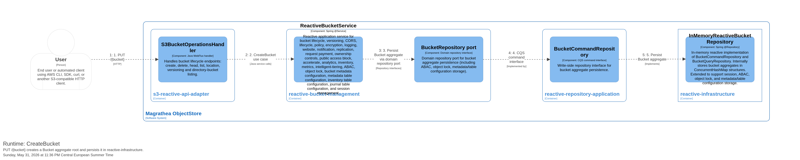

**Flow:**
1. User → s3-reactive-api-adapter: `PUT /{bucket}`
2. s3-reactive-api-adapter → reactive-bucket-management: CreateBucket use case
3. reactive-bucket-management → reactive-repository-application: Save Bucket aggregate via command repository
4. reactive-repository-application → object-store-reactive-repository-storage-engine-infrastructure: Persist Bucket aggregate through the default Storage Engine backend

**Durability note:** the full `BucketConfig` document is committed to `metadata/buckets/` via `BucketStore` with a crash-safe temp-file + atomic-rename write, so the bucket survives a process restart. Legacy in-memory adapters are test/retirement scaffolding and are not an alternate single-node runtime.

=== Scenario 2 — PutObject

.Runtime Diagram — PutObject
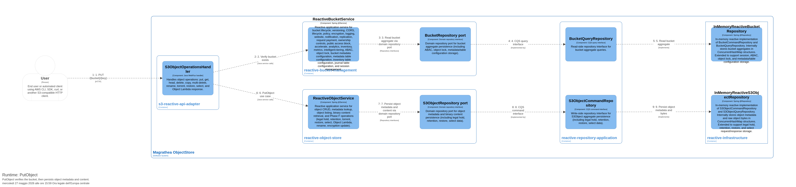

**Flow:**
1. User → s3-reactive-api-adapter: `PUT /{bucket}/{key}`
2. s3-reactive-api-adapter → reactive-object-store: PutObject use case (handler delegates directly — no bucket check in handler)
3. reactive-object-store → reactive-repository-application: Save object metadata and bytes via command repository
4. reactive-repository-application → reactive-infrastructure: Persist object metadata and bytes

**Note:** Bucket existence validation is postponed to the repository layer. The handler does not verify bucket existence before delegating.

=== Scenario 3 — GetObject

.Runtime Diagram — GetObject
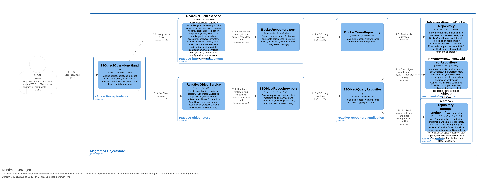

**Flow:**
1. User → s3-reactive-api-adapter: `GET /{bucket}/{key}`
2. s3-reactive-api-adapter → reactive-object-store: GetObject use case (handler delegates directly — no bucket check in handler)
3. reactive-object-store → reactive-repository-application: Read object metadata and bytes via query repository
4. reactive-repository-application → reactive-infrastructure: Read object metadata and bytes from persistence

**Note:** Bucket existence validation is postponed to the repository layer. The handler does not verify bucket existence before delegating.

=== Scenario 4 — Multipart Upload Lifecycle

.Runtime Diagram — Multipart Upload
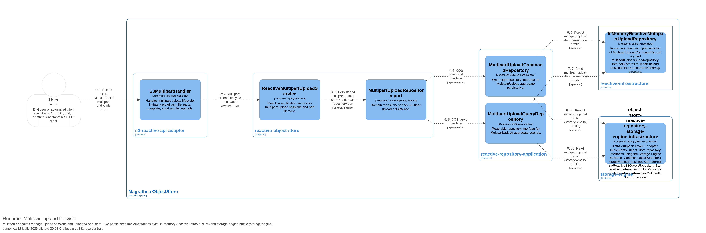

**Flow:**
1. User → s3-reactive-api-adapter: POST/PUT/GET/DELETE multipart endpoints
2. s3-reactive-api-adapter → reactive-object-store: Multipart upload lifecycle use cases
3. reactive-object-store → reactive-repository-application: Write multipart upload state via command repository
4. reactive-object-store → reactive-repository-application: Read multipart upload state via query repository
5. reactive-repository-application → reactive-infrastructure (default) or storage-engine adapter: Persist multipart upload state
6. reactive-repository-application → reactive-infrastructure (default) or storage-engine adapter: Read multipart upload state from persistence

**Durability note:** in storage-engine mode, the upload id, key, initiated timestamp, and every recorded part (part number, ETag, size) are committed to `metadata/multipart-uploads/` via `MultipartUploadStateStore`, so in-progress uploads survive a process restart and can be listed/aborted after recovery. Multipart **part-body** persistence through the storage engine (as opposed to session state) remains an open item (EP-3).

=== Scenario 5 — Bucket Configuration (CORS, Lifecycle, Policy, Encryption, Logging, Website, Notification, Replication, Request Payment, Ownership Controls, Public Access Block, Accelerate, Analytics, Inventory, Metrics, Intelligent-Tiering, ABAC, Object Lock, Metadata Configuration)

.Runtime Diagram — Bucket Configuration
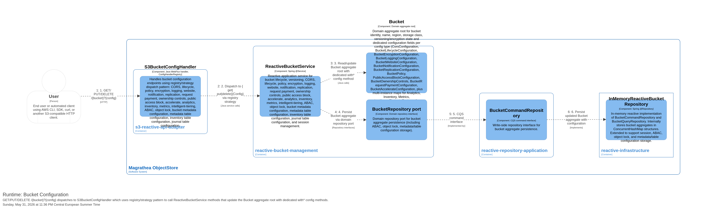

**Flow:**
1. User → s3-reactive-api-adapter: `GET/PUT/DELETE /{bucket}?{config}` with query parameter identifying the configuration type
2. s3-reactive-api-adapter → reactive-bucket-management: `S3BucketConfigHandler` dispatches to `ReactiveBucketService.{get|put|delete}{Config}` based on query parameter
3. reactive-bucket-management → reactive-repository-application: `BucketCommandRepository.{save|delete}` or `BucketQueryRepository.{find}` reads/writes configuration via the Bucket aggregate root
4. reactive-repository-application → reactive-infrastructure: `InMemoryReactiveBucketRepository` persists updated Bucket aggregate with configuration

**Configuration types and query parameters:**

As of the EP-2 metadata durability work, every family below is a value object on `BucketConfig` and persists through `bucket.withBucketConfig(...)` / dedicated `with*()` methods — durable in storage-engine mode, in-memory-only in the default profile.

[cols="3,2,1,3",options="header"]
|===
|Configuration |Query Param |List support |Domain Value Object

|CORS |`?cors` |No |`CorsConfiguration`
|Lifecycle |`?lifecycle` |No |`BucketLifecycleConfiguration`
|Policy |`?policy` |No |`BucketPolicy` (String)
|Encryption |`?encryption` |No |`BucketEncryptionConfiguration`
|Logging |`?logging` |No |`BucketLoggingConfiguration`
|Website |`?website` |No |`BucketWebsiteConfiguration`
|Notification |`?notification` |No |`BucketNotificationConfiguration`
|Replication |`?replication` |No |`BucketReplicationConfiguration`
|Request Payment |`?requestPayment` |No |`BucketRequestPaymentConfiguration`
|Ownership Controls |`?ownershipControls` |No |`BucketOwnershipControls`
|Public Access Block |`?publicAccessBlock` |No |`PublicAccessBlockConfiguration`
|Accelerate |`?accelerate` |No |`BucketAccelerateConfiguration`
|Analytics |`?analytics` |Yes (`list-type`) |`BucketAnalyticsConfiguration`
|Inventory |`?inventory` |Yes (`list-type`) |`BucketInventoryConfiguration`
|Metrics |`?metrics` |No |`BucketMetricsConfiguration`
|Intelligent-Tiering |`?intelligent-tiering` |No |`BucketIntelligentTieringConfiguration`
|ABAC |`?abac` |No |`AbacConfiguration` (rules: id, principal, resource, action, conditions)
|Object Lock (bucket default) |`?object-lock` |No |`BucketObjectLockConfiguration`
|Bucket Metadata Configuration |`?metadata-config` |No |`BucketMetadataConfiguration` (rules: id, status, resourceType, resourceSubtype)
|Bucket Metadata Table Configuration |`?metadata-table-config` |No |`BucketMetadataTableConfiguration` (rules: id, status, tableName, database)
|Inventory Table Configuration |`?inventory-table-config` |No |`BucketInventoryTableConfiguration`
|Journal Table Configuration |`?journal-table-config` |No |`BucketJournalTableConfiguration`
|===

=== Scenario 6 — Phase F Advanced Object Operations

**Description:** Phase F adds advanced/specialized operations from ADR 0012 while reusing existing RouterFunction and handler patterns.

**Flow:**
1. User → s3-reactive-api-adapter: sends an advanced S3 request such as RenameObject, RestoreObject, SelectObjectContent, WriteGetObjectResponse, legal hold, retention, torrent, or encryption update.
2. `S3PathRouter` dispatches by HTTP method, path, query parameter, and headers.
3. `S3ObjectOperationsHandler` handles advanced object behavior such as rename, torrent, restore, select, and Object Lambda response.
4. `S3ObjectMetadataHandler` handles metadata-oriented Phase F operations such as legal hold, retention, and encryption update.
5. Reactive services/repositories are used where object or bucket state must be read or updated.

**Verification:** S3 adapter Cucumber remains evidence-gated; current per-suite counts are tracked in `docs/test-report.md` rather than duplicated here to avoid staleness. AWS CLI parity is improved for canonical object CRUD basics, including slash-containing object keys, but not complete for all S3 scenarios.

=== Scenario 6b — Admin Static Asset and Documentation UI

**Description:** Container packaging regenerates the admin UI and documentation artifacts inside the Docker builder stage and packages them into `bootstrap-application` classpath resources. Host-generated bootstrap static resources are excluded from the Docker build context by `.dockerignore`.

**Flow:**
1. Docker builder stage → source docs/UI: regenerate ARC42 JSON, ADR JSON, test-report JSON, copied documentation images, and Vue admin UI assets.
2. Browser/Admin UI → bootstrap-application: request `/`, `/assets/*`, or `/docs/*`.
3. bootstrap-application → classpath `static/**`: serves generated Vue assets, ARC42 JSON, ADR JSON, JaCoCo JSON exports, C4 PNG images, and ARC42 image resources.
4. Browser/Admin UI renders documentation and links to `/admin/**` JSON endpoints for operational data.

**Verification boundary:** The container build verifies required generated files are present and JSON/image inputs exist. The static asset packaging path does not change S3 API semantics or storage-engine runtime behavior.

=== Scenario 6c — Admin Configuration-as-Code Catalog API

**Description:** Operators and the implemented Object Storage Admin Application use `/admin/**` JSON endpoints to inspect health/readiness, backend status, YAML-backed catalogs, capacity/quota, and operational-report availability. These endpoints are separate from the public S3 object API; catalogs remain read-only at runtime.

**Flow:**
1. Operator/Admin UI → admin-api-adapter: `GET /admin/health` to discover admin links and confirm configuration-as-code mode.
2. Operator/Admin UI → admin-api-adapter: `GET /admin/storage-policies`, `GET /admin/storage-devices`, or `GET /admin/disk-sets` for catalog lists.
3. admin-api-adapter → storage-engine catalog ports: read policies, devices, or disk sets from the configured YAML-backed catalogs.
4. admin-api-adapter → Operator/Admin UI: return JSON list/detail responses with `_links`.
5. Optional validation: `POST /admin/storage-policies/validate` parses the submitted policy payload and returns `{valid, errors, policy}` without writing YAML files or changing active runtime state.
6. Runtime mutation requests such as `POST /admin/storage-policies`, `PUT /admin/storage-policies/{id}`, and `DELETE /admin/storage-policies/{id}` return `405 Method Not Allowed` with an `admin-catalog-read-only` error.

**Verification:** `PhaseEp7AdminApiRequirementsCucumberTest` passed 18 executed scenarios / 132 steps for `REQ-ADMIN-023..031`; 17 other scenarios were excluded by its Admin API tag filter.

**Implemented browser boundary (ADR 0026):** The runtime composition is Product Shell → Object Storage Product Extension, with application-owned browser adapters. Product screens call the Admin Control Plane for non-S3 administration. An optional HeadObject diagnostic calls the separately configured S3 Data Plane client and has no Admin/storage-engine bypass. Playwright/axe passed 39/39 tests across 360/768/1440-pixel Chromium viewports.

**Unavailable-provider flow:** UI → typed Admin client → operational report route → optional provider port. If no provider is configured, the route returns HTTP 503 `report-provider-not-configured` with `availability: not-configured`, and the UI renders an unavailable state without fabricated records.

=== Scenario 6c.1 — Bounded Local EC Reconstruction (accepted ADR 0032)

[NOTE]
====
Status: *implementation-informed / implemented-and-validated for local `REQ-PIPELINE-017`*. The focused gate passes 5 scenarios / 46 steps and all 15 four-of-six EC 4+2 survivor combinations. No repair publication or distributed behavior is implied.
====

1. A prior local EC write commits schema-3 metadata for one stripe's six artifacts, including explicit stripe/shard/k/m/parity/logical-length/stored-length/SHA-256/transport-neutral-location facts.
2. The caller resolves exactly four checksum-valid survivor bytes from those committed locations and identifies one or two unavailable indexes. Filesystem paths are not passed as location authority.
3. `BoundedEcReconstructionPort` validates schema/layout completeness and survivor uniqueness, range, committed length, and SHA-256. Ambiguous schema-2 EC, contradictory metadata, fewer than `k` valid survivors, and unknown schemas fail closed.
4. The adapter moves GF(256) work from the Reactor caller onto the injected one-worker/16-queue scheduler and owns only one stripe, at most six shard buffers, and fixed matrix/index workspace.
5. It reconstructs the requested data/parity shards, verifies every regenerated length/SHA-256 against the committed schema-3 facts, and emits the exact logical stripe length without final-stripe padding.
6. The result contains only verified local stripe/regenerated-shard snapshots and workspace measurements. No filesystem replacement, manifest/reference/location write, scanner/daemon, cluster transfer, Ratis job, rebalance, cleanup, or fault action occurs.

=== Scenario 6c.2 — Fixed Distributed EC 4+2 Publication (accepted ADR 0033)

[NOTE]
====
Status: *implementation-informed / implemented-and-validated for internal `REQ-CLUSTER-015`*. The focused gate passes 5 scenarios / 40 steps. Clustered S3 EC reads and healing are not implied.
====

1. Coordinator A receives six already durable schema-3 EC 4+2 shards and incrementally verifies each shard plus the logical object SHA-256.
2. Committed fixed membership supplies three distinct failure domains. Deterministic placement assigns A=`0,3`, B=`1,4`, and C=`2,5`.
3. A verifies its two authoritative local shards and opens four readiness-gated grpc-java/mTLS streams to B/C. Receivers verify, fsync, and atomically publish each immutable shard before acknowledging it.
4. `EcReferencePublicationService` accepts exactly one matching durable acknowledgement for every shard; missing, conflicting, or stale evidence fails without a command.
5. Membership and epochs are revalidated. Ratis independently validates the complete fixed layout and commits one `EC_4_2` reference containing object facts and six transport-neutral shard locations.
6. Payload remains outside the Ratis command/log/snapshot. Complete voter restart recovers the same generation and locations.
7. Clustered S3 read selection/reconstruction, replacement publication, self-healing, rebalance, cleanup, dynamic membership, and parameterized EC remain later flows.

=== Scenario 6d — Fixed-Cluster CreateBucket (ADR 0028)

[NOTE]
====
Status: *implementation-informed / implemented-and-validated for `REQ-CLUSTER-001`*. The status is limited to the fixed A/B/C profile.
====

.Runtime — consensus-committed bucket generation
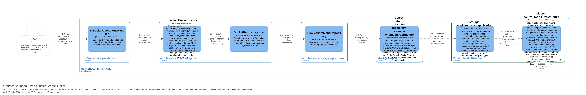

1. A client sends unconditional `CreateBucket` through the existing S3 endpoint and Object Store-to-Storage Engine adapter on node A.
2. `storage-engine-cluster-application` proposes a new bucket generation to the fixed A/B/C Ratis voter group.
3. The control group commits the generation after its two-voter majority; bucket bytes or an alternate internal object API are not involved.
4. S3 success follows the commit, and `HeadBucket` through node B resolves the committed generation.

Bucket configuration families, conditional creation, dynamic membership, and wider namespace behavior are outside this first slice.

=== Scenario 6e — Whole-Object Quorum PUT (ADR 0028)

[NOTE]
====
Status: *implementation-informed / implemented-and-validated for the fixed write path and its two no-publication failures (`REQ-CLUSTER-002..004`)*.
====

.Runtime — fixed `N=3/W=2` whole-object write
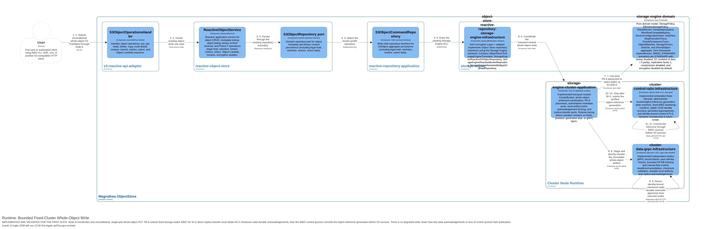

1. A client sends an unconditional, single-part whole-object `PUT` through node A's existing S3 boundary.
2. The cluster application resolves the committed bucket generation and selects fixed replica targets A, B, and C.
3. The coordinator transfers unpublished whole-object bytes directly through independent grpc-java data services. The bounded bridge uses 64 KiB-or-smaller payload frames, finite queues/in-flight demand, readiness checks, deadlines, and cancellation; object bytes do not transit the Ratis log.
4. A target acknowledges only after durable publication and checksum/length validation.
5. Fewer than `W=2` valid durable acknowledgements fails the operation. There is no degraded-write fallback, and staged bytes remain unreachable.
6. After `W=2`, the control group commits an object-reference generation naming verified immutable replicas. Loss of control quorum still fails publication. S3 success follows the reference commit, not merely replica receipt.

=== Scenario 6f — Coordinator-Loss Exact-Byte GET (ADR 0028)

[NOTE]
====
Status: *implementation-informed / implemented-and-validated for `REQ-CLUSTER-002`*. It proves one stopped coordinator while B and C remain reachable, not general partition tolerance or production readiness.
====

.Runtime — stop A, then exact-byte GET through B
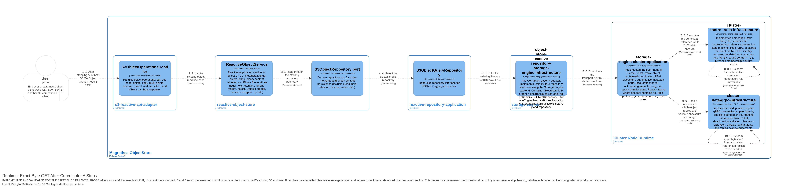

1. After a successful write, the real-process acceptance environment stops coordinator node A without changing fixed membership.
2. A client sends `GET /{bucket}/{key}` through node B's S3 endpoint.
3. B and C retain the two-voter control quorum and resolve exactly the committed bucket/object-reference generation; no replica comparison chooses metadata.
4. B reads a referenced checksum-valid whole-object replica and returns it through S3.
5. WebTestClient and AWS CLI validation compare the response byte-for-byte with the uploaded fixture and verify its length, SHA-256, and ETag.

=== Scenario 6g — Complete Fixed-Cluster Restart (ADR 0028)

[NOTE]
====
Status: *implementation-informed / implemented-and-validated for `REQ-CLUSTER-005`*. Recovery is from the same non-empty roots and fixed membership; node replacement and membership change are not covered.
====

.Runtime — complete A/B/C restart
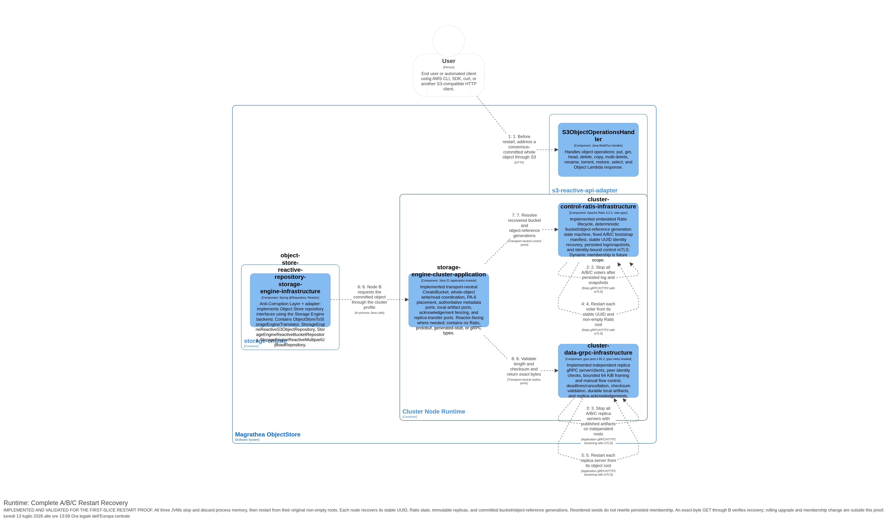

1. Stop A, B, and C and discard process memory after the bucket and object-reference generations are committed.
2. Restart all three JVMs against their original non-empty identity, Ratis, object, temporary, and runtime roots, with seed order changed to `C,A,B`.
3. Each node recovers its stable UUID; seed order does not rewrite persisted three-voter state or committed generations.
4. A `GetObject` through B returns the original exact bytes, length, SHA-256, and ETag.

The shared Java 21 real-process gate now passes `REQ-CLUSTER-001..005`, `019`, and `020` in both WebTestClient and AWS CLI modes (14 scenarios, 188 steps); its repair-only `019/020` run passes 4 scenarios / 80 steps. Focused Ratis/gRPC/cross-module scenarios pass for `REQ-CLUSTER-008..013`, and the historical repair-control `021..026` result passes 22 scenarios / 210 steps. Root Maven success is only supporting integration evidence. Those whole-object results do not cover clustered multipart, conditional/versioned writes, clustered S3 EC reads, EC self-healing, dynamic membership, rebalance, orphan cleanup, rolling upgrades, or the broader partition suite; bounded periodic discovery is separately evidenced by `REQ-CLUSTER-027`, and fixed internal EC 4+2 placement/transfer by `REQ-CLUSTER-015`. Local output-only reconstruction under ADR 0032 remains separate evidence.

=== Scenario 6h — Missing-local Repair Before GET Response (accepted ADR 0029)

[NOTE]
====
Status: *implementation-informed / implemented-and-validated for `REQ-CLUSTER-019`*. This is bounded current-generation repair, not broad anti-entropy or production readiness.
====

.Runtime — durable repair of known local absence
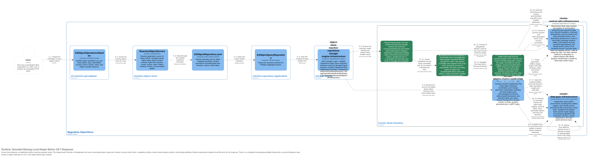

1. The read use case resolves the current consensus-committed whole-object reference and exact artifact length/SHA-256.
2. Before any response payload starts, the target establishes that its promised local artifact is missing. It performs no complete payload preflight.
3. Application code durably ensures or deduplicates the canonical repair key and may obtain an inline claim. Consensus binds the claim to a stable node/process session and increments `claimGeneration`.
4. The worker revalidates the same current generation and fetches from a different named replica over the direct data path. It incrementally verifies the complete length/checksum, fsyncs, atomically publishes, and fsyncs the parent directory.
5. Success is proposed only for the exact current fencing token. An uncertain completion result remains idempotently queryable/retryable.
6. The GET opens the repaired local artifact once and streams it while calculating integrity metadata. This is the only filesystem read for the response; no local preflight/read-again cycle exists.
7. If no named source verifies, the job becomes `BLOCKED`, an integrity/repair alert is emitted, and GET fails rather than returning unverified bytes.

=== Scenario 6i — Single-pass Corruption Failure and Repair Later (accepted ADR 0029)

[NOTE]
====
Status: *implementation-informed / implemented-and-validated for `REQ-CLUSTER-020`*. The corrupt request is never reported as transparently recovered; only a later GET may succeed.
====

.Runtime — corruption fails now, repair benefits a later GET
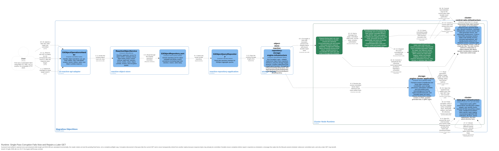

1. The current reference names the local artifact, so GET opens it once and streams while incrementally validating length/SHA-256.
2. Corruption discovered during that pass fails the current request. Because response bytes may already have been emitted, the server does not open a remote replica and transparently retry the same request.
3. Application code durably ensures/deduplicates repair for the still-current promised target. Scheduling repair does not convert the failed GET into success; if ensure cannot commit, an unscheduled-repair alert is required.
4. A later claimed worker rechecks currentness, transfers a different named verified replica directly, stages under its fencing token, and crash-safely replaces the corrupt target.
5. Consensus commits `SUCCEEDED` only after durable exact publication for the current token. If no verified source remains, work is `BLOCKED` and the target stays unavailable.
6. A subsequent GET may read the repaired local payload once and succeed.

=== Scenario 6j — Bounded Retry Across Restart or Leader Change (accepted ADR 0029)

[NOTE]
====
Status: *implementation-informed / implemented-and-validated for bounded `REQ-CLUSTER-024`*. The 2026-07-14 focused gate passed 7 scenarios / 168 steps across all seven real-filesystem/gRPC interruption points. No general chaos, broad partition, rolling-upgrade, dynamic-membership, anti-entropy, rebalance, cleanup, or production-readiness behavior is implied.
====

In this focused runtime harness, B is the independently crashable/restarted JVM, receives distinct PIDs, and reuses its original non-empty identity, Ratis, and filesystem roots. A/C voters and the source-C real grpc-java server remain in the parent Cucumber JVM. The runtime executes actual B-to-C reads with UUID-bound mTLS and token-specific staging/publication, then inspects bytes/hashes and verifies exact-target no-recopy, stale-token fencing, last-valid-snapshot-plus-log recovery after interrupted version-2 snapshot installation, a committed completion whose reply is withheld, and live A-to-C leadership transfer.

.Runtime — snapshot recovery, reclaim, and stale-token rejection


1. Ratis commits one deterministic job and claim generation `g1`; the worker may crash before transfer, during transfer, or after durable publication but before completion commits.
2. Versioned snapshot plus log replay retains identity, specification, state, attempt/dedup history, owner session, claim generation, retry timing, and last-applied metadata. Object bytes and staging files are not snapshot content.
3. Restart or leader-ready notification only wakes a scheduler. A replacement process has a new session; reclaim is a committed transition that increments the token to `g2`.
4. The `g2` worker rechecks that the bound generation remains current. If the target is already exact and durable, it treats that as idempotent success; otherwise it retries bounded verified transfer.
5. Completion for `g2` may commit. A late `g1` renew/fail/succeed command is rejected with no state effect. If the reference changed, the old job becomes terminal `OBSOLETE` and is never rewritten to the newer generation.

Prepared-artifact intents, orphan cleanup, rebalance, periodic discovery, dynamic membership, distributed erasure coding, multipart, and broader partition handling are outside these three request/repair-triggered flows. Bounded periodic current-reference discovery is the separate flow below; broad `REQ-CLUSTER-017` remains partial.

=== Scenario 6k — Bounded Periodic Current-reference Discovery and Repair (accepted ADR 0031)

[NOTE]
====
Status: *implementation-informed / implemented-and-validated for bounded `REQ-CLUSTER-027`*. The focused 2026-07-14 gate passes 2 scenarios / 36 steps. No rebalance, automated orphan cleanup, wider healing/topology, ADR 0030 general-chaos, scale, or production-readiness behavior is implied.
====

1. `ClusterNodeRuntime` starts one process-local discovery scheduler for each fixed node. A cycle issues one bounded read-only Ratis query using its current exclusive cursor; the state machine returns only current references in canonical bucket/object-key order.
2. The scheduler serially considers page records and ignores any reference whose replica UUID set does not name that local node. For a named obligation, a `boundedElastic` filesystem probe verifies existence and committed length/SHA-256.
3. An exact target completes inspection without repair work. A missing or corrupt target delegates a durable ensure to ADR 0029's canonical consensus job, then signals the existing bounded repair scheduler. PA-6 plans do not count as execution.
4. Existing repair claim generation/process-session fencing selects a different named verified source, transfers over grpc-java with UUID-bound mTLS, rechecks the current generation before publication, and publishes only exact fsynced bytes. Payload never enters Ratis and discovery never rewrites the reference.
5. Only after every page record and required durable ensure completes does the cursor advance to the page's exclusive last-record cursor. Query/probe/ensure failure leaves it unadvanced for a later cycle. Repair execution failure remains explicit consensus retry state rather than discovery success.
6. A terminal page resets the next cycle to the first page. Closing and reconstructing the process-local scheduler also begins at the first page; repeated observations deduplicate through the consensus repair identity. Shutdown cancels active delayed discovery and leaves no active page/target probe.
7. Process-local counters expose cycles, pages, records, target states, failure stages, repair failures, retries, resets, stale references, deduplication, overlap, and replica reads without payloads or credentials.

This is an eventually repeated sequence of bounded current-state pages, not a frozen consensus snapshot spanning the sweep. The cursor is neither logged nor snapshotted. Broad `REQ-CLUSTER-017` remains partial because wider healing/topologies, rebalance, and automated orphan cleanup remain absent.

=== Scenario 7 — Reactive Chain Pattern

**Description:** The reactive chain pattern used throughout the application layer. No blocking `.join()`, no `Mono.fromCallable`, no `.subscribeOn(Schedulers.boundedElastic())`.

**Flow:**
1. Handler receives `ServerRequest`
2. Handler calls reactive service method — returns `Mono<T>` or `Flux<T>`
3. Service method composes repository operations using `Mono.defer`, `Mono.just`, `Mono.justOrEmpty`, `Flux.defer`, `Flux.fromIterable`
4. Repository operations use native `ConcurrentHashMap` lookups wrapped in `Mono.just`/`Mono.justOrEmpty`
5. Handler chains operators: `.flatMap(service::method)`, `.flatMap(service::method2)`, `.map(domain::toDto)`
6. Handler returns `ServerResponse.ok().body(...)` or `ServerResponse.status(code).body(...)`

**Example:**
```java
// Handler — no blocking, no thread pool offload
public Mono<ServerResponse> handleGet(ServerRequest request) {
    return bucketService.findBucket(bucketName)
        .flatMap(bucket -> {
            CorsConfiguration config = bucket.corsConfiguration();
            return Mono.justOrEmpty(config)
                .map(GetBucketCorsQuery::from);
        })
        .flatMap(query -> ok().body(BodyInserters.fromValue(query)))
        .switchIfEmpty(Mono.defer(() -> errorResponse(404, "NoSuchBucket")));
}
```

=== Scenario 8 — Runtime Effects

**Description:** Runtime effects that execute during request processing to enforce S3 semantics.

==== CORS Validation

**Trigger:** Any request with `Origin` header.
**Behavior:** `S3BucketConfigHandler` checks bucket CORS configuration. If the origin is not allowed, returns `403 Forbidden` with `AccessForbidden` error. If CORS preflight (`OPTIONS`), validates method, headers, and origin.

==== Website Routing

**Trigger:** Request to a bucket configured as a website (`?website`).
**Behavior:** `S3BucketOperationsHandler` redirects `GET /{bucket}` to the configured website endpoint if the bucket has website configuration.

==== OwnershipControls Enforcement

**Trigger:** `PutObject`, `PutObjectAcl` requests.
**Behavior:** If bucket has `OwnershipControls` with `ObjectOwnerRequired`, the request must include `x-amz-object-ownership` header.

==== PublicAccessBlock Evaluation

**Trigger:** ACL or policy modification requests.
**Behavior:** If `PublicAccessBlock` is enabled, blocks public ACLs or public bucket policies.

==== Accelerate Header Injection

**Trigger:** Response to `GetObject`, `HeadObject`, `GetBucketAccelerateConfiguration`.
**Behavior:** If bucket has accelerate configuration, response includes `x-amz-accelerate-result` header.

==== RequestPayment Enforcement

**Trigger:** Requests to buckets with `RequestPayment` configured.
**Behavior:** If bucket has `RequesterPays` enabled, requests must include `x-amz-request-payer` header or return `403 AccessDenied`.

=== Scenario 9 — Error Handling

**Description:** System behavior for error conditions.

- **NoSuchBucket:** Handler returns `404 Not Found` with S3 XML `<Error><Code>NoSuchBucket</Code>...`
- **NoSuchKey:** Handler returns `404 Not Found` with S3 XML `<Error><Code>NoSuchKey</Code>...`
- **BucketAlreadyExists:** Handler returns `409 Conflict` with S3 XML `<Error><Code>BucketAlreadyExists</Code>...`
- **InvalidArgument:** Handler returns `400 Bad Request` with S3 XML `<Error><Code>InvalidArgument</Code>...`

All error responses use `S3WebSupport.errorResponse()` which creates a Jackson 3 XML annotated `S3Error` record and serializes it via the registered `JacksonXmlEncoder`. Reactive error handling uses `Mono.error()` and `Flux.error()` with custom exception classes, caught at the handler level and mapped to S3 XML error responses.
