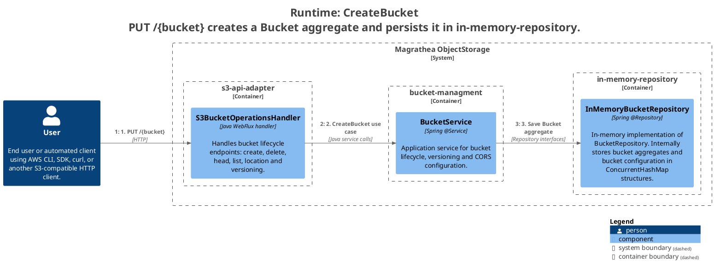
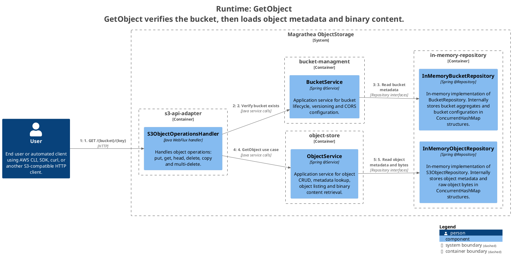
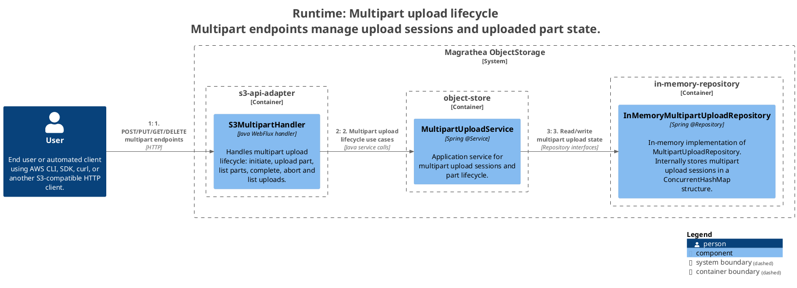

ifndef::imagesdir[:imagesdir: ../images]

[[section-runtime-view]]
== Runtime View

The runtime view describes the key interaction scenarios of the Magrathea ObjectStorage system. These scenarios illustrate how the building blocks collaborate to implement S3-compatible operations.

=== Scenario 1 — CreateBucket

.Runtime Diagram — CreateBucket

**Flusso:**
1. User → s3-api-adapter: `PUT /{bucket}`
2. s3-api-adapter → bucket-managment: CreateBucket use case
3. bucket-managment → in-memory-repository: Save Bucket aggregate

=== Scenario 2 — PutObject

.Runtime Diagram — PutObject

**Flusso:**
1. User → s3-api-adapter: `PUT /{bucket}/{key}`
2. s3-api-adapter → bucket-managment: Verify bucket exists
3. bucket-managment → in-memory-repository: Read bucket metadata
4. s3-api-adapter → object-store: PutObject use case
5. object-store → in-memory-repository: Save object metadata and bytes

=== Scenario 3 — GetObject

.Runtime Diagram — GetObject

**Flusso:**
1. User → s3-api-adapter: `GET /{bucket}/{key}`
2. s3-api-adapter → bucket-managment: Verify bucket exists
3. bucket-managment → in-memory-repository: Read bucket metadata
4. s3-api-adapter → object-store: GetObject use case
5. object-store → in-memory-repository: Read object metadata and bytes

=== Scenario 4 — Multipart Upload Lifecycle

.Runtime Diagram — Multipart Upload

**Flusso:**
1. User → s3-api-adapter: POST/PUT/GET/DELETE multipart endpoints
2. s3-api-adapter → object-store: Multipart upload lifecycle use cases
3. object-store → in-memory-repository: Read/write multipart upload state

=== Scenario 5 — Error Handling

**Description:** System behavior for error conditions.

- **NoSuchBucket:** Handler returns `404 Not Found` with S3 XML `<Error><Code>NoSuchBucket</Code>...`
- **NoSuchKey:** Handler returns `404 Not Found` with S3 XML `<Error><Code>NoSuchKey</Code>...`
- **BucketAlreadyExists:** Handler returns `409 Conflict` with S3 XML `<Error><Code>BucketAlreadyExists</Code>...`
- **InvalidArgument:** Handler returns `400 Bad Request` with S3 XML `<Error><Code>InvalidArgument</Code>...`

All error responses use `S3WebSupport.errorResponse()` which creates a Jackson 3 XML annotated `S3Error` record and serializes it via the registered `JacksonXmlEncoder`.
