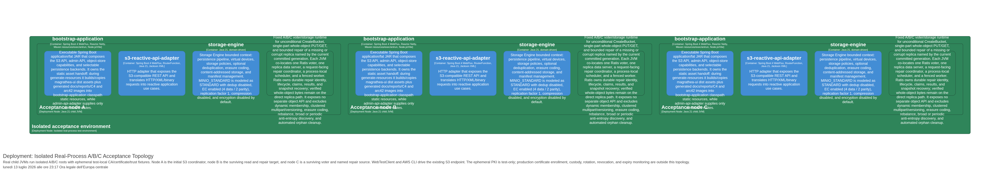

ifndef::imagesdir[:imagesdir: ../images]

[[section-deployment-view]]
== Deployment View

=== Development Environment

**Single node, running locally.**

[cols="2,4",options="header"]
|===
|Element |Description

|Runtime JAR
|`bootstrap-application-0.1.0-SNAPSHOT.jar` running on the configured HTTP port

|Object Storage Admin Browser Application
|Independently built static distribution executed in the operator's browser. It composes the Product Shell, Object Storage Product Extension, application-owned browser adapters, and documentation viewer.

|Static resources
|Generated browser application and documentation assets, ARC42 JSON, ADR JSON, JaCoCo JSON exports, C4 PNGs, and ARC42 images served by `bootstrap-application` from classpath `static/**`

|Bare local default backend (`single-node` profile)
|In-memory (ConcurrentHashMap), allocated in the same JVM heap as the server; does not persist across restarts. This default is retained for unpackaged development/test compatibility.

|Storage Engine backend (`storage-engine` profile)
|Filesystem-durable: bucket registry, multipart upload state, per-object configuration, and S3 object manifest references are committed under a configurable filesystem root (`storage.engine.filesystem.root`) with crash-safe temp-file + atomic-rename writes; packaged JVM/native container images activate this backend by default for single-node deployments.

|Java Runtime
|JDK 21 bytecode for the normal JAR path; the optional Spring Boot 4 native executable is built with GraalVM 25 and removes the runtime JVM requirement

|Build Tool
|Apache Maven 3.9+
|===

=== Docker Deployment

A JVM `Dockerfile`, a native-image `Dockerfile.native`, and `docker-compose.yml` are present at the project root for containerized execution:

**Dockerfile:**

* Builder stage: Maven 3.9 + Eclipse Temurin 21 from public ECR mirrored Docker Hub images, with Node.js installed for documentation/frontend generation
* Regenerates web documentation and frontend static assets inside the builder stage from source-controlled docs and the `magrathea-ui` workspace
* Builds isolated `object-storage` and `magrathea-example` products from one Product Shell artifact; the `frontend-packaging-validation` target builds both products and documentation twice and compares path-sorted SHA-256 inventories
* The canonical `docker build --network=host --target frontend-packaging-validation -t magrathea-frontend-packaging-validation:local .` gate passed for EP-7
* Runs the Gherkin requirements appendix quality gate (`--check` against the committed appendix) before regenerating it deterministically, so the image build fails if the ARC42 appendix is stale relative to the shared requirement feature files
* Copies the full `scripts/` gate set so root Maven validation can run module-layering checks during packaging
* Does not copy host-generated `bootstrap-application/src/main/resources/static/**` assets; `.dockerignore` excludes those generated resources from the build context
* Packages with unmasked Maven failure semantics; Maven fail-never (`-fn` / `--fail-never`) is not used
* Runtime stage: Eclipse Temurin 21 JRE, copies the packaged Spring Boot JAR from the builder
* Runs as non-root user `magrathea` with writable `/app/data`
* Copies YAML storage-policy, storage-device, and disk-set catalogs into `/app/config` and sets `SPRING_PROFILES_ACTIVE=storage-engine`, `MAGRATHEA_OBJECT_STORE_BACKEND=storage-engine`, and `STORAGE_ENGINE_*` paths so packaged single-node containers use the storage-engine backend rather than in-memory repositories
* Exposes ports 8080 and 8081 and defines an Admin API healthcheck against `/admin/health`; EP-5 also exposes `/admin/live` and `/admin/ready` for process liveness and catalog readiness probes
* Declares OCI version, revision, and source labels supplied by the deterministic build/release gate
* Validated first slice: image build, Admin API health/live/ready smoke with ready catalog status, S3 ListBuckets XML and bucket/object PUT/GET smoke, selected storage-engine backend log check, and no Spring Boot generated-password banner in build/runtime logs
* `REQ-OPS-025` additionally validates the `0.1.0` image as non-root with a named `/app/data` volume, direct SIGTERM exit without a forced kill, removal/recreation from the same image ID and volume, ready Admin probes after replacement, exact persisted S3 object bytes, and expected version/revision/source identity; the release workflow runs this gate before publication
* Entrypoint: `java -jar /app.jar`

**Dockerfile.native:**

* Builder stage: GraalVM 25 `native-image` with musl support, Maven, Node.js and Python for the same documentation/frontend regeneration pipeline used by the JVM image
* Runs the Gherkin requirements appendix quality gate (`--check`) before deterministic regeneration
* Activates Maven profiles `native,native-musl` and compiles `bootstrap-application` into a `magrathea-objectstorage` native executable
* Runtime stage: `alpine`, non-root user, no JRE/JDK installed, storage-engine profile/catalog environment configured, ports 8080 and 8081 exposed
* Validated first slice: image build, Admin API health/readiness smoke, S3 ListBuckets XML/JSON and bucket/object PUT/GET smoke, no Spring Boot generated-password banner, no native reflection/shared-arena runtime errors, and no `java`/`javac` in the runtime image
* Entrypoint: `/app/magrathea-objectstorage`

**docker-compose.yml:**

* Single service `magrathea-s3` on port `8080:8080`
* Environment variables for configuration, including backend profile selection and `storage.engine.filesystem.root`

=== Storage Engine Filesystem Layout (storage-engine profile)

When the `storage-engine` profile is active, durable state is organized under the configured filesystem root as follows:

[cols="2,3",options="header"]
|===
|Path |Contents

|`nodes/*/chunks/`, `devices/*/`
|Content-addressed chunk storage and dedup index (Storage Engine core)

|`metadata/manifests/`
|Object manifests (ordered chunk references, checksums)

|`metadata/s3-object-references/`
|Latest bucket/key → manifest reference (`S3ObjectManifestReferenceStore`)

|`metadata/buckets/`
|Bucket registry: full `BucketConfig` document per bucket (`BucketStore`)

|`metadata/multipart-uploads/`
|Multipart upload sessions: upload id, key, initiated timestamp, recorded parts (`MultipartUploadStateStore`)

|`metadata/object-config/`
|Per-object configuration: legal hold, object lock, retention, encryption, restore state (`ObjectConfigMetadataStore`)
|===

Every document under `metadata/**` is committed with the same crash-safe discipline: write to a temp file in the target directory, then atomically rename over the final path. Concurrent writers to the same key are serialized through striped per-key locks.

=== Historical EP-8 Hardened Single-node Evidence Deployment

[NOTE]
====
Status: *implementation-informed / bounded historical packet*. The hardened single-node and evidence-wiring results remain evidence for their recorded revision only. Current complete-reactor `REQ-SUPPLY-001` is `@implemented-not-e2e-validated`; this is not a cluster deployment or publication claim.
====

The historical clean evidence run is bound to revision `209b3170b64d3311ba9b773fdb7bd5581519e682` and exact local image ID `sha256:e5b5862948853a613f8b92adc8135fa81b84bdd9f36c9ae8d69b9a6bd6dd7966`; the manifest records `published=false`. Runtime validation passed with UID/GID 10001, read-only root filesystem, explicit writable data and temporary mounts, `no-new-privileges`, capability drop `ALL`, no host PID/IPC/network/UTS namespaces, and no container-engine socket. User-namespace remapping was unavailable in the local engine and is recorded as unavailable rather than claimed. The production reactor subsequently gained four cluster modules; no new clean-revision application SBOM/license/image packet covers them, and the later dirty-working-tree root test is not acceptance supply-chain evidence.

The configured Admin readiness endpoint reported the `storage-engine` backend ready. An exact 129-byte object with recorded checksum and ETag remained byte-identical after replacement from the same image and persisted storage. This proves the bounded hardened-container contract, not multi-node durability.

CI runs the architecture contract and application evidence job on ordinary workflow execution. A scheduled or explicitly requested job runs the image SBOM, hardened runtime, fail-closed OWASP, and complete supply-chain evidence contract, retaining both successful artifacts and scan-error evidence for 30 days. These jobs do not publish an application or image.

=== Implemented Fixed Three-Node First Slice (ADRs 0027 and 0028)

[NOTE]
====
Status: *implementation-informed / partial*. The fixed real-process A/B/C runtime and acceptance topology are validated for the first slice only. This is not a production deployment recommendation or a complete EP-10 deployment.
====

.Fixed three-node runtime with bounded repair

The diagram shows the implemented fixed-node deployment boundary and accepted ADR 0029 repair responsibilities. The cluster profile starts fixed nodes A, B, and C as separate JVMs. Each JVM co-locates one Ratis voter, one whole-object replica server, and process-local repair coordination/worker execution, and owns distinct persisted identity, Ratis log/snapshot, object, temporary, and runtime roots. Control and data services have separate ports and lifecycle ownership. The implemented version baseline is Ratis 3.2.2/`ratis-grpc`, grpc-java 1.82.2/`grpc-netty-shaded`, and protobuf 3.25.8.

A static manifest is identical on A/B/C and contains their stable UUIDs plus control/data addresses. It bootstraps exactly one three-voter group and does not overwrite recovered non-empty consensus or identity state; reordered seeds are restart-tested. It cannot add, promote, demote, replace, or remove nodes. Health suspicion, timeout, address edits, or seed order are not membership transitions.

All cluster control and direct-replica connections use mutually authenticated TLS bound to stable node identities in the validated slice. Plaintext, anonymous, server-authentication-only, wrong-CA, expired, and UUID-mismatched peers are rejected by focused mechanism scenarios. Operational enrollment, trust distribution, key custody, rotation, revocation, expiry monitoring, and recovery remain absent production PKI infrastructure.

.Real-process acceptance baseline

The focused S3 acceptance gate starts three Java 21 child JVM processes with separate roots and test-local CA, per-node certificate, and trust-store fixtures. Shared WebTestClient and AWS CLI scenarios create and resolve a bucket across nodes, replicate a whole object at fixed `N=3/W=2`, stop coordinator A and retrieve exact bytes through B while B+C retain quorum, reject publication below data or control quorum, then stop and restart all three JVMs from non-empty roots and retrieve the same object. The expanded shared gate for `REQ-CLUSTER-001..005/019/020` passes 14 scenarios / 188 steps; the original `001..005` subset remains 10 / 108 and repair-only `019/020` is 4 / 80.

Test-local certificate generation proves only that mTLS was exercised in this environment. The Testcontainers 2.0.2 dependency remains pinned but is not the process isolation used by this real-process S3 gate. Ordinary root Maven results remain supporting integration evidence and must not be reported as the focused EP-10 acceptance result.

The implemented runtime covers unconditional `CreateBucket`, whole-object `PUT`/`GET`, and bounded repair of a missing or corrupt target already named by the current reference. Clustered multipart, conditional/versioned or chunked writes, erasure coding, dynamic membership, certificate lifecycle, broad periodic anti-entropy, rebalance, orphan cleanup, rolling upgrade, online multi-node backup/DR, and broader partition behavior remain not implemented or unvalidated. No production distributed-cluster claim is made.

==== Implemented bounded repair deployment (accepted ADR 0029)

Status: *implementation-informed / bounded*. `REQ-CLUSTER-019/020/021/022/023/025/026` are implemented and validated; `REQ-CLUSTER-024` and broad `REQ-CLUSTER-017` are partial.

Repair adds no deployment node, external API, or alternate byte path. `ClusterNodeRuntime` co-locates and owns the start/stop lifecycle of the process-local scheduler and fenced worker in each A/B/C JVM. Each process uses its stable UUID plus a new process-session ID. Existing Ratis roots persist version-2 snapshot/log repair metadata; object/temporary roots hold token-specific staging and final artifacts. Control ports carry ensure/claim/result commands, while direct mTLS replica ports carry verified whole-object bytes.

The scheduler is not authority and carries no durable work: startup or committed-work signals only wake bounded consensus queries. Restart and leader change do not transfer ownership implicitly; reclaim requires a newer committed claim generation, and a stale process cannot renew or complete the reclaimed job. The full seven-point real-filesystem/gRPC crash matrix remains unexecuted, so `REQ-CLUSTER-024` stays partial. This deployment does not establish failure-domain placement, production scheduling capacity, rolling upgrade, or broader partition tolerance.

Prepared-artifact intents and orphan cleanup, rebalance, broad periodic anti-entropy, dynamic membership, erasure coding, multipart, and broader partition handling remain outside the deployment change.

=== Production Deployment (Future)

The current single-process deployment is intentionally monolithic for single-node operation. Enterprise Production Readiness phases (`PLAN.md`, EP-0..EP-11) sequence the path to production, including:

* EP-1 (Security & Identity): SigV4 authentication, deny-by-default authorization, audit logging, and real SSE are implemented and validated for the built-in scope
* EP-2 (Complete Metadata Durability): bucket registry, multipart state, and per-object/bucket configuration are durable in storage-engine mode (`@implemented-and-validated` for the declared storage-engine scope; in-memory profile explicitly exempt)
* EP-3 (Reactive Streaming Completion): bounded-memory GetObject, upload, multipart, whole-object, and EC artifact pipelines are implemented and validated
* EP-4 (Space Management & Data Hygiene): typed GC, dedup reachability, quotas, ENOSPC behavior, and scrubbing are implemented and validated for single-node operation
* EP-5 (Operability & Delivery): implemented and validated for the `0.1.0` single-node JVM 21 preview. Mandatory CI runs the full root gate and generated/source checks before image validation. The tag-driven release workflow enforces SemVer/OCI identity, immutable version/minor/SHA tags, digest recording, persistent-volume container replacement, and live Prometheus-to-Alertmanager delivery before publication. SIGTERM validation covers committed, streaming, multipart, concurrent, cancellation, abort-race, and bounded mixed-load paths. Offline backup/restore and same-node DR validate RTO 30 seconds and RPO as the last completed backup. Typed object manifests use schema `2`; multipart sessions, bucket registry, object configuration, object references, ACL sidecars, and capacity ledgers use schema `1`; all accept documented legacy version `0` and reject unsupported future versions. Live Loki/external paging is deployment integration, sustained/production load belongs to EP-6, and online/multi-node DR belongs to EP-10.
* EP-6 (Performance & Capacity): implemented and validated for the `0.1.x` single-node safety envelope. S3 routes enforce 256 MiB single/assembled object limits, 64 MiB multipart parts, finite timeout, 16 active requests, 64 TCP connections, and a 100 requests/s token bucket with burst 200. Mandatory 45-second CI load and weekly/manual 15-minute soak run eight deterministic workers under `-Xmx256m`, produce machine-readable evidence, and assert bounded heap, checksums, and idle resources. These gates are not production sizing or competitive benchmarks.
* EP-7 (Complete Admin Panel): `REQ-ADMIN-001..031` UI/contracts and reproducible packaging are implemented and validated. The phase remains partial because credential/tenant administration and real recovery/GC/scrub/audit/metrics/traces providers are absent; provider routes return truthful HTTP 503 not-configured responses.
* EP-8 (Cluster Architecture ADR & Supply Chain): accepted architecture wiring and the explicitly validated evidence guards remain implementation-informed. Current complete-reactor `REQ-SUPPLY-001` is `@implemented-not-e2e-validated` because the historical clean-revision SBOM/license/image packet predates the four cluster modules; its hashes remain historical only. No publication occurred, and OWASP vulnerability status remains unknown/error.
* EP-10 (S3 Cluster, multi-node): `@partial`. Fixed A/B/C is implementation-informed and validated for `REQ-CLUSTER-001..005`, `008..013`, `019..023`, `025`, and `026`; `014`, `017`, and `024` remain partial, while `006/007`, `015/016`, and `018` remain not implemented. Broader transfer semantics, dynamic membership, broad anti-entropy/rebalance/cleanup, the complete crash matrix, and broader partitions remain open.

No production distributed-cluster claim follows from the bounded first slice; see `PLAN.md` for current status per phase.
